# Cockapoo Cafe

### Aim
The aim iof this site is to promote the Cockapoo Cafe. By giving it an online presence it will increase the number of people visiting the Cafe, making reservations and leaving positive reviews about the Cafe.

## Description
The Cockapoo Cafe provides the user with the ability to interact with the cafe online. Firstly  upon landing on the site you are greeted with a vibrant and welcoming page which clearly portrays the purpose of the site. As a non registerred user you can view the contact page, Review page and Menu page, with little interaction possibilities. On the Contact page you will see the address of the cafe, a map clearly displaying the cafe's location and a contact form where you can request information from the cafe by senting a generated email. The Menu page the user is able to see different food and drink different categories, when clicked on they can then see theMenu Items for the chosen category. The user will be able to see the popularity of the menu items by the how many likes it has received but will not be able to like an item unless they are logged in. The user will also be able to view the veviews left by other users. This will help them get a feel for the cafe and influance their decision to visit, register, make a reservation and share their experience with other users too.
When the user has dicided to register or is a returning user, they have  means available to them in order to interact with the site. Firstly they will visit the register/log-in section on the navigation bar which will direct them to the appropriate page. Once registerred/logged in they will see a message to tell then they are logged in. At this point the site becomes more interactive and the user can like menu items, leave a review and like/unlike reviews and they can make/ update and delete reservations at the cafe. The site owners have not forgotten either! The cafe also has the ability to add new categories and items to it's menu. They are also able to update and delete categories and menu items which could depend on their popularity and entice new customers. The cafe owner also has the ability to approve any reviews that are left by users. This is to make sure that standards are up held and no poor language can be posted. Once the review has been approved by the cafe owner it will then appear on the sites review page. The cafe owner is also able to see any reservations that have been made and approve or reject them from the site. This allows the cafe to reserve tables in the shop and also keep a record of their bookings. They can use this to make sure that they don't become overbooked.

The live game can be viewed [here](https://cockapoo-cafe.herokuapp.com/).

## Wireframes


[Click here for the wireframe](/readme_images/cockapoo-cafe-mock-up.png)

## Database Design

### Menu
<br>
Categories Model
<br>
name = models.CharField(max_length=200)
description = models.TextField(blank=False)

<br>
Menu-Items Model
<br>
name = models.CharField(max_length=200)
category = models.ForeignKey(Category, on_delete=models.DO_NOTHING)
slug = models.SlugField(max_length=200, default=name)
description = models.TextField(blank=False)
image = CloudinaryField('image', default='placeholder')
price = models.FloatField()
status = models.IntegerField(choices=STATUS, default=1)
created_on = models.DateTimeField(auto_now_add=True)
updated_on = models.DateTimeField(auto_now=True)
likes = models.ManyToManyField(User, related_name='menuitems', blank=True)

### Reservation
<br>
Reservation Model
<br>
first_name = models.CharField(max_length=100, unique=False)
last_name = models.CharField(max_length=100, unique=False)
email = models.EmailField(max_length=100, unique=False)
phone = models.CharField(validators=[Phone_Regex], max_length=60,
                         null=True, blank=True)
time = models.CharField(max_length=100, choices=Reservation_Choices,
                        default='9')
datetime = models.DateField(auto_now_add=False, null=True, blank=False)
information = models.TextField(blank=False,
                                default='Please enter number of people:')
sent_date = models.DateField(auto_now_add=True)
accepted = models.BooleanField(default=False)
rejected = models.BooleanField(default=False)
accepted_date = models.DateTimeField(auto_now=True, null=True)
user = models.ForeignKey(User, blank=True, null=True,
                         on_delete=models.CASCADE)

### Review
<br>
Review Model
<br>
author = models.ForeignKey(
    User, on_delete=models.CASCADE, related_name="User")
title = models.CharField(max_length=200, default='no_title', null=True,
                            blank=True)
body = models.TextField()
image = CloudinaryField('image', default='review_placeholder')
created_on = models.DateTimeField(auto_now_add=True)
updated_on = models.DateTimeField(auto_now=True)
status = models.IntegerField(choices=STATUS, default=0)
approved = models.BooleanField(default=False)
likes = models.ManyToManyField(User, related_name='reviews', blank=True)


#### Security

Database connection details are set up in an [env.py](https://pypi.org/project/env.py/) for development, for 
security reasons this is not uploaded to GitHub so that database and connection details are not visible to 
users. In production these are stored in Heroku. 

## Epics and User Stories

 * EPIC: As a site admin/User I can Register/sign in to the site so that I can interact with the site.
1. As a new user I can Easily register for the site so that I can interact with the site content.
2. As a returning user I can login to the site so that I can interact with the site content.
 * EPIC: As a site admin/User I can view the Cafe menu so that I can see what the cafe offers.
3. As a site admin I can create new items to add to the menu so that I can change the options on offer.
4. As a site admin I can Edit/ Delete items on the menu so that Keep the menu up to date.
5. As a site admin/user I can see the number of likes a menu item has so that I can see how popular it is.
 * EPIC: Users are able to make table reservations. Site owners can manage the reservations.
6. As a User I can Create, edit and delete a reservation so that I can manage the reservation.
7. As a site admin I can approve/disapprove reservations so that to make sure that there is enough room for the guests.
* EPIC: Reviews can be created, edited, approved and liked/unliked.
8. As a User I can Create, edit and delete a review of my experience so that I can share my experience of the cafe with future users.
9. As a User I can Like/unlike fellow users reviews so that I can interact with the sites users.
10. As a site Admin I can approve/disapprove reviews so that I can filter objectionable comments.
* EPIC: The customer is able to contact the cafe so they can have any questions answered and know how to get to the cafe.
11. As a User I can See the location of the cafe so that I know how to get there.
12. As a site admin I can be notified of a message being received so that I can respond promptly.
* EPIC: Landing Page
13. As a user I can intuitively understand the site and meaning so that I know if I want to stay on the site.
14. As a user I can intuitively navigate the site so that I can register/ login and make a reservation.
15. As a user I can Follow the sites social networks so that I can see events and offers.

## Features

### Existing Features
* Responsive design.
* Website title and information on the site purpose.
* Navigation Menu (Site Wide).
* Postgress databases to store information and user login/profile information.
* CRUD Functionality
* Login functionality.
* Logout functionality.
* Accepted Reviews visable to all users.
* Users Reservations visable to only to that user.
* Administrative control over Reservations and Reviews for the admin.
* Registered user Reservation and Review creation and management.
* Admin creation and management of Menu.


### Future Features
* Implement a reservation archive
* Admin receive notifications in the navigation bar if a reservation has been requested.

## Technologies Used

* [HTML](https://en.wikipedia.org/wiki/HTML)
	* This project uses HTML as the main language used to complete the structure of the Website.
* [CSS](https://en.wikipedia.org/wiki/CSS)
	* This project uses custom written CSS to style the Website.
* [JavaScript](https://en.wikipedia.org/wiki/JavaScript)
    * JavaScript is used for the google map on the contact page [mapsjs](https://developers.google.com/maps)
    * [jQuery](https://jquery.com/) is used for the following: 
        * Mobile side nav
        * Displaying Success/Fail message verifying contact form status.
        * To populate downdrops on select elements.
* [Python](https://www.python.org/)
    * This projects core was created using Python, the back-end logic and the means to run/view the Website.
    * Python Modules used (These can be found in the requirements.txt project file):
        * asgiref==3.4.1
        * cloudinary==1.28.0
        * dj-database-url==0.5.0
        * dj3-cloudinary-storage==0.0.6
        * Django==3.2.9
        * django-allauth==0.46.0
        * gunicorn==20.1.0
        * oauthlib==3.1.1
        * psycopg2==2.9.2
        * PyJWT==2.3.0
        * python3-openid==3.2.0
        * pytz==2021.3
        * requests-oauthlib==1.3.0
        * sqlparse==0.4.2
* [Django](https://en.wikipedia.org/wiki/Django_(web_framework))
    * This project was created using the Django framework, the back-end logic and the means to run/view the Website.
* [Bootstrap](https://getbootstrap.com/)
    * The Bootstrap framework was used through the website for layout and responsiveness.
* [Google Fonts](https://fonts.google.com/)
	* Google fonts are used in the project to import the *Yeseva One* fonts for the nav title.
* [GitHub](https://github.com/)
	* GithHub is the hosting site used to store the source code for the Website.
* [Gitpod](https://gitpod.io/)
	* Gitpod is used as version control software to commit and push code to the GitHub repository where the source code is stored.
* [Heroku](https://dashboard.heroku.com/apps)
    * Heroku was used to deploy the live website.
* [Google Chrome Developer Tools](https://developers.google.com/web/tools/chrome-devtools)
	* Google chromes built in developer tools are used to inspect page elements and help debug issues with the site layout and test different CSS styles.
* [balsamiq Wireframes](https://balsamiq.com/wireframes/)
	* This was used to create wireframes for 'The Skeleton Plane' stage of UX design.
* [Font Awesome](https://fontawesome.com/)
    * All the Icons displayed throughout the website are Font Awesome icons.
* [Favicon](https://favicon.io/)
    * Favicon.io was used to make the site favicon 
* [Am I Responsive](http://ami.responsivedesign.is/#)
    * Multi Device Website Mockup Generator was used to create the Mock up image in this README

## Bugs

### Fixed
* When I created the reservation form, it was not a good experience as a user to enter a date. To solve this I used a datepicker and implemented through the create_review view and Update_review view.
* I implemented emailjs to send the contact message on the contact page, which worked but the messages to confirm the messsage had been sent didn't display so I removed emailjs and used python to send the email.
* When I tried to upload an image on the review form the image would't load and the placeholder inage was set. In order to solve this I had to use enctype="multiport/formdata" in the form which I found when searching stackoverflow. Images are now loaded and saved on both create and update forms.
* When a form was submitted the success messages were not displaying. I had to import success messages in the view and add them in the view perameters.
* I had trouble getting the like button to change to unlike when the user hads liked the item. To fix I had to use the all() in the tamplate tag.
* An error was highlighted on the Review.html page when put through the HTML validator. This was corrected by adding an alt to the image and moving the width="100%" to the css file.
* The pep8 validator picked up a line with whitespace on it in the reservation update view and review update view. This was resolved by removing the whitespace.
* When a user made a reservation sometimes they were unabel to see it. This was because the page was paginated by the date and so it appeared on a different page. To solve this I removed the pagination.
### Known issues
* The contact tab in the nav doesn't show up as active when on the page, instead the home page does, this could be down to the contact page being in the home app.

## Testing

Testing is required on all features and user stories documented in this README. 
All clickable links must redirect to the correct pages. All forms linked to the database
must be tested to ensure they insert all given fields into the correct collections.

HTML Code must pass through the [W3C HTML Validator](https://validator.w3.org/#validate_by_uri).

CSS Code must pass through the [W3C CSS Validator](https://jigsaw.w3.org/css-validator/).

JavaScript code must pass through the [JSHint Validator](https://jshint.com/).

Python Code must pass through [PEP8 Validator](http://pep8online.com/)


The website was extensively tested as it was developed using:
* print().
* The terminal by printing the expected outcome.
* Testing User Stories.
* Testing scenarios manually.
* Testing functionallity manually.

This project has been tested throughout its inception. Each input has been thoroughly tested to make sure that any invalid inputs are handled correctly and a response is shown to the user.

### Testing User Stories

1. As a new user I can easily register for the site so that I can interact with the site content.

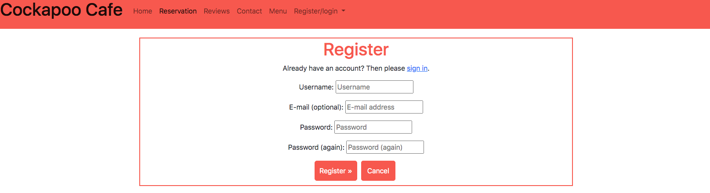

* When the user navigates to the register button in the navigation bar or clicks the reservation tab, if not logged in, they are directed to the register page. Filling in the form is quick and easy. Once filled out the user is navigated back to the home page where they are displayed a message to say they have registered for the site.
* This has been tested manually to ensure it works as it should.

2. As a returning user I can login to the site so that I can interact with the site content.

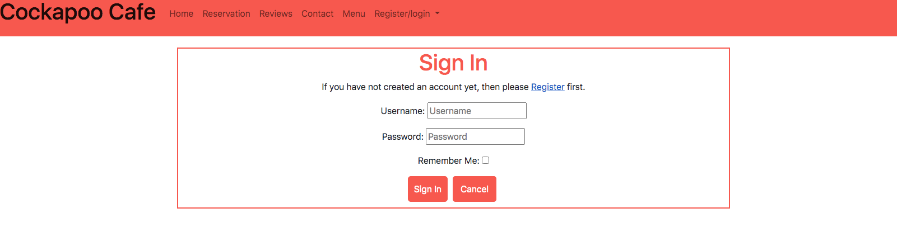

* If the user is a returning user they will be able to sign in using the signin tab in the navigation bar. They are given a message to say that they are now signed in.
* This has been tested manually to ensure it works as it should.

3. As a site admin I can create new items to add to the menu so that I can change the options on offer.

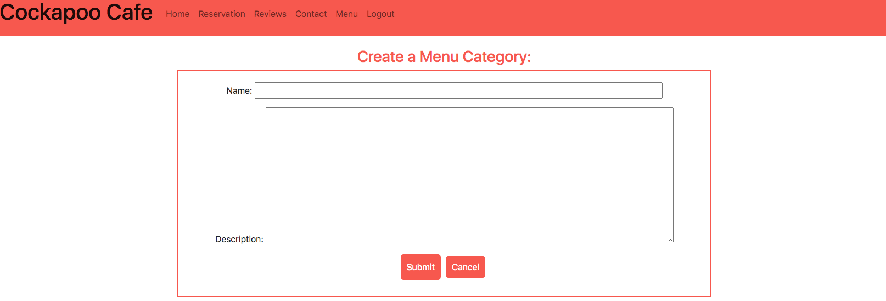

* The admin can create a new menu category and are displayed a message to let them know that the category has been created.
* This has been tested manually to ensure it works as it should.

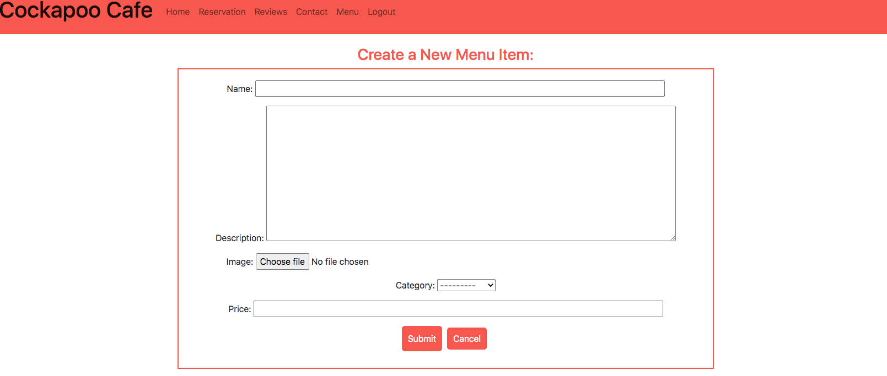

* The admin can create a new menu Item and are displayed a message to let them know that the menu item has been created.
* This has been tested manually to ensure it works as it should.

4. As a site admin I can Edit/ Delete items on the menu so that Keep the menu up to date.

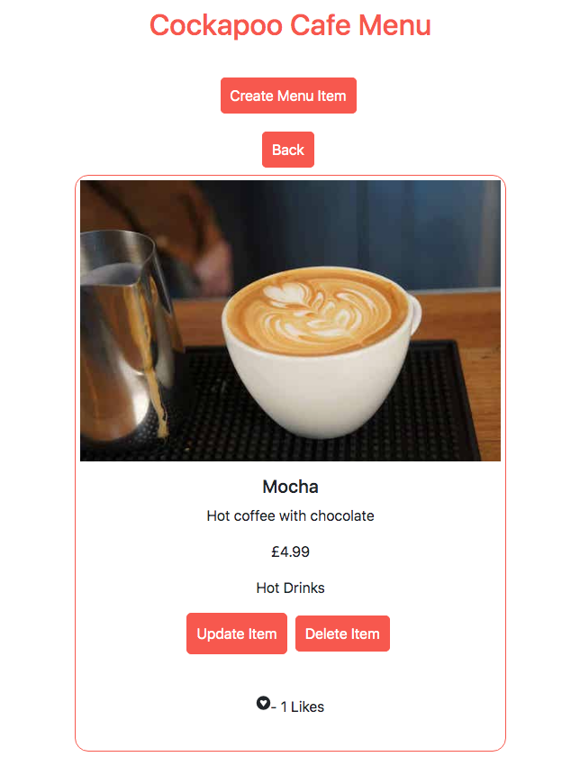

* By clicking the relevant button the admin can update or delete the selected menu item and are displayed a message to let them know that the menu item has been updated/deleted.
* This has been tested manually to ensure it works as it should.

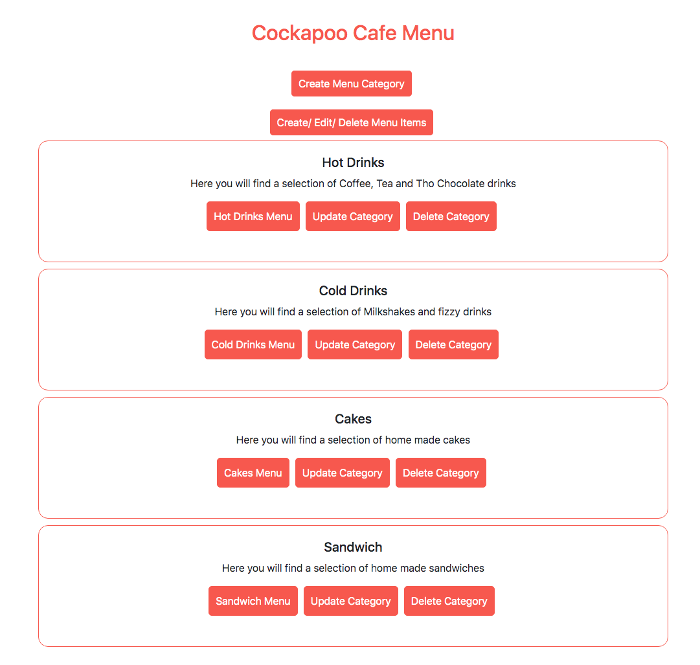

* By clicking the relevant button the admin can update or delete the selected menu category and are displayed a message to let them know that the category has been updated/deleted..
* This has been tested manually to ensure it works as it should.

5. As a site admin/user I can see the number of likes a menu item has so that I can see how popular it is.


* The user is informed if their guess is incorrect. A list of the letters they have guessed so far will be displayed along with the number of guesses they have left and an image of the hangman position they are at.
* This has been tested manually to ensure it works as it should.

6. As a User I can Create, edit and delete a reservation so that I can manage the reservation.

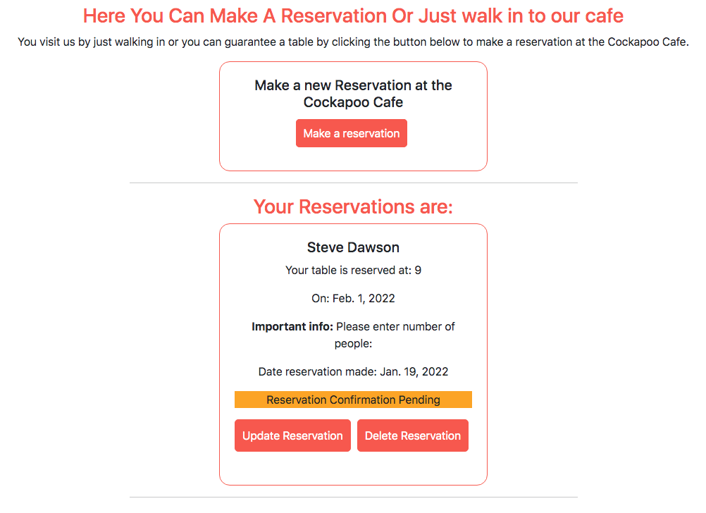

* When the logged in user navigates to the reservation page, they will see a card to create a reservation. once created they will get a message to say it has been created and then will be able to update and delete the reservation by selecting the appropriate button. The reservation also has a traffic light system to inform the user if their reservation is pending, accepted or rejected. The user will be displayed a message each time they create/ update or delete a reservation.
* This has been tested manually to ensure it works as it should.


7. As a site admin I can approve/disapprove reservations so that to make sure that there is enough room for the guests.

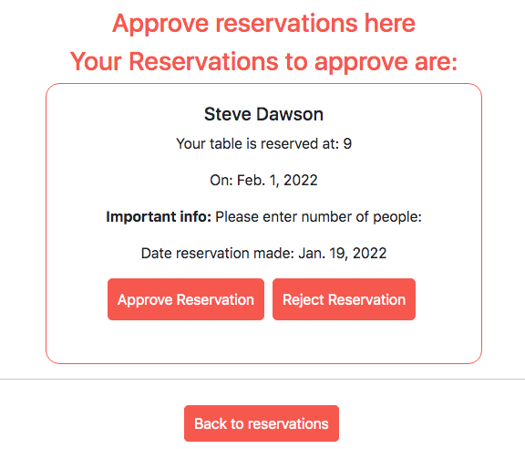

* The admin is able to approve or reject reservations by selecting the appropriate button. Once done the reservation will be removed from this page and the reservation traffic light system will change accordingly, informing the user and the admin that the reservation has been accepted or rejected. The admin will be displayed a message to inform them that the reservation has been accepted or rejected.
* This has been tested manually to ensure it works as it should.

8. As a User I can Create, edit and delete a review of my experience so that I can share my experience of the cafe with future users.

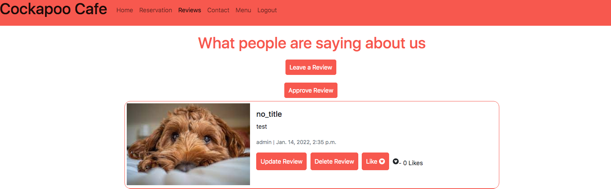

* The user is able to create a review of the cafe by clicking the button Leave a Review. Once they have completed the form and submitted the review will be sent for approval to the admin and will not show in the review page. Once the admin has approved the review the review will be displayed on the review page. The user will then be able to Update or delete their review by selecting the appropriate button on their review. The user will be displayed a message each time they create/ update or delete a review.
* This has been tested manually to ensure it works as it should.

9. As a User I can Like/unlike fellow users reviews so that I can interact with the sites users.


* The user is able to like and unlike reviews of the cafe by clicking the button Like/Unlike. Their like will be added to any previous likes and change the number of likes that review has.
* This has been tested manually to ensure it works as it should.

10. As a site Admin I can approve/disapprove reviews so that I can filter objectionable comments.

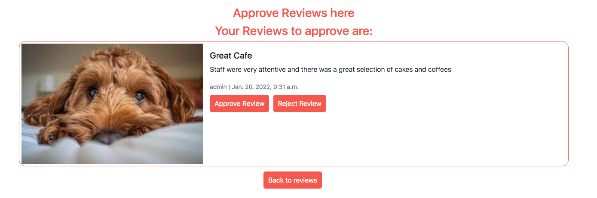

* When the user has left a review, the review will not be displayed until it has been accepted by the site admin. The site admin has the ability to approve or reject the review by going to the manage review page via the button only visable to the admin and then selecting the appropriate button to accept or reject the review. If the review is rejected it will be deleted.
* This has been tested manually to ensure it works as it should.

11. As a User I can See the location of the cafe so that I know how to get there.

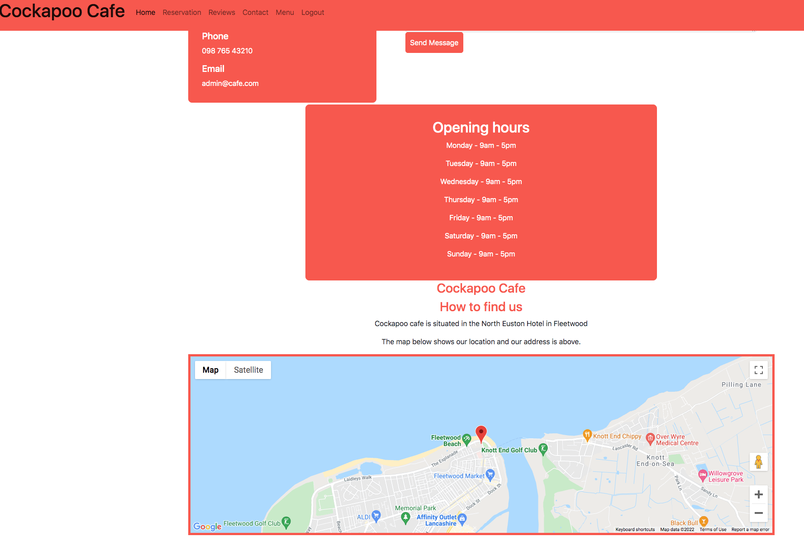

* The user is able to view the location of the cafe on a google map on the contact page. Above the map there is also the address of the cafe which could be used to put into a car sat nav for directions.
* This has been tested manually to ensure it works as it should.

12. As a site admin I can be notified of a message being received so that I can respond promptly.

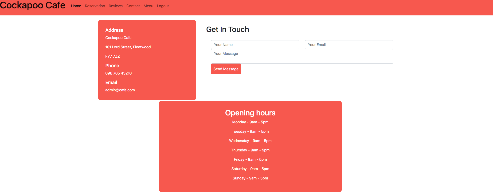

* The user is able to contact the cafe by phone or by email by completing the form on the contact page. Once the user clicks send mesasage, an email will be sent to the cafe with the name entered, email address the user entered to reply to and the content of the message.
* This has been tested manually to ensure it works as it should.

13. As a user I can intuitively understand the site and meaning so that I know if I want to stay on the site.

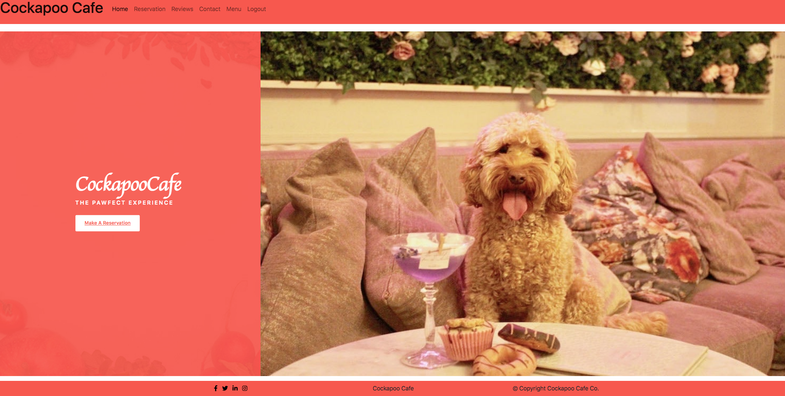

* When a user first lands on the site the purpose is clear, with a large title with the name of the cafe, images on the page and a link to make a reservation at the cafe.
* This has been tested manually to ensure it works as it should.

14. As a user I can intuitively navigate the site so that I can register/ login and make a reservation.


* The user is able to navigate the site intuitively as the navigation bar is site wide, meaning it is the same on every page. On sub pages of the main navigation pages there are buttons to go back to the main page.
* This has been tested manually to ensure it works as it should.

15. As a user I can Follow the sites social networks so that I can see events and offers.


* The user is able to view the cafe's social networks by clicking on the icons at the bottom of the page in the footer, this will help keep them uptodate with any offers or news the cafe has. These links will open in a new tab.
* This has been tested manually to ensure it works as it should.

### Validator Testing

Full test results can be found [here](TESTING.md)

### Testing on Devices

* I have tested the deployed Heroku app on different devices such as Macbook Pro, Samsung Galaxy Tab and iphone. I have found no issues with the site working on them.

## Deployment on Heroku

This project was deployed through Heroku using the following steps:

### Requirements and Procfile
Heroku needs to know which technologies are being used and any requirements, so I created files to let it know. Before creating the Heroku app, create these files using the following steps in GitPod: 
* In the GitPod terminal, type ```pip3 freeze --local > requirements.txt``` to create your requirements file.
* Create your Procfile and insert the following code: ```web: gunicorn cafe2021.wsgi``` and make sure there is no additional blank line after it. 
* Push these files to your repository.

### Creating Heroku App
* Log into Heroku
* Select 'Create New App' from your dashboard
* Choose an app name (if there has been an app made with that name, you will be informed and will need to choose an alternative)
* Select the appropriate region based on your location
* Click 'Create App'

### Connecting to GitHub
* From the dashboard, click the 'Deploy' tab towards the top of the screen
* From here, locate 'Deployment Method' and choose 'GitHub'
* From the search bar newly appeared, locate your repository by name
* When you have located the correct repository, click 'Connect'
* DO NOT CLICK 'ENABLE AUTOMATIC DEPLOYMENT': This can cause unexpected errors before configuration. We'll come back to this.

### Environment Variables
* Click the 'Settings' tab towards the top of the page
* Locate the 'Config Vars' and click 'Reveal Config Vars'
* Enter all variables needed:
SECRET_KEY - Random key generated online or manually
CLOUDINARY_URL - Cloudingary generated and copied from website
DATABASE_URL - Postgres generated
GOOGLE_MAPS_API - Google maps API Key
EMAIL_ADDRESS - Site's email address 
EMAIL_PASSWORD - Password from email client 

### Heroku Postgres Database
* Go to cloudingary.com and sign up for a free account
* Once logged in navigate to the cloudinary dashboard and copy the API Environment variable.
* Paste variable in to Heroku config vars.

### Heroku Postgres Database
* Go to the resources tab in Heroku.
* In the Add-ons search bar look for Heroku Postgres & select it.
* Choose the Hobby Dev-Free option in plans.
* Click submit order form.
* Go back to the build environment and install 2 more requirements:
  * ```pip3 install dj_databse_url```
  * ```pip3 install psycopg2-binary```
  make sure to add these to the requirements file using ```pip3 freeze > requirements.txt``` 

## Set up Emails

**I used Gmail for the email on the contact page. Others can be used but will need a few changes**

* Go to settings.py and change the EMAIL_HOST_USER to your chosen email address.
* If you want to set up a new Gmail account for the site, this is the time to do so.
* Go to the Gmail account and open the 'Settings' tab.
* Go to 'Accounts and Imports' > 'Other Google Account Settings'.
* Go to the 'Security' tab and open 'Signing in to Google'.

* Click on '2-step Verification', click 'Get Started' and turn on 2-step verification following their instructions.
* Go to 'Security' > 'Signing in to Google' > 'App Passwords'.
* (You may have to input your account password again) Set 'App' to 'Mail', 'Device' to Other, and name it Django.
* The passcode that appears will be used in your Heroku variables.

  ## Deploy
* In Heroku, once all the variables are in place, locate 'Manual Deploy' > choose the master branch and click 'Deploy Branch'.
* Once the app is built (it may take a few minutes), click 'Open App' from the top of the page.
* Go back to the 'Deploy' tab and you can now click 'Enable Automatic Deployment'. Changes automatically deploy when you make a git push.

## Forking the Repository
* Log in to GitHub and locate the GitHub Repository.
* At the top of the Repository above the "Settings" Button on the menu, locate the "Fork" Button.
* You will have a copy of the original repository in your GitHub account.
* You will now be able to make changes to the new version and keep the original safe. 

## Making a Local Clone
* Log into GitHub.
* Locate the repository.
* Click the 'Code' dropdown above the file list.
* Copy the URL for the repository.
* Open Git Bash on your device.
* Change the current working directory to the location where you want the cloned directory.
* Type ```git clone``` in the CLI and then paste the URL you copied earlier. This is what it should look like:
  * ```$ git clone https://github.com/Steven-Dawson18/cockapoo-cafe```
* Press Enter to create your local clone.

You will need to install all of the packages listed in the requirements file you can use the following command in the terminal ```pip install -r requirements.txt``` which will do it for you. 

## Credits

### Code
* Date picker for reservation form - https://stackoverflow.com/questions/46735767/django-1-11-createview-adding-datepicker-for-datefields

### Media
* Images - All images used are taken from google images.

### Acknowledgments
My mentor Antoino Rodriguez for his advice and guidance.
Code Institutes Tutor support for their help and guidance.