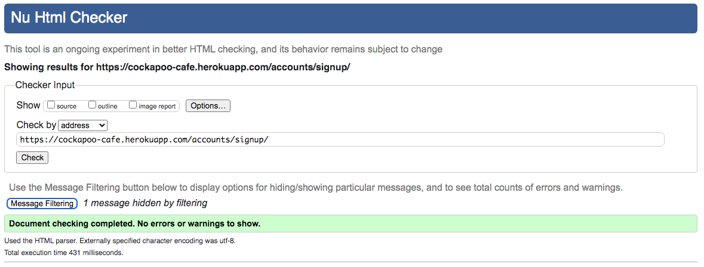
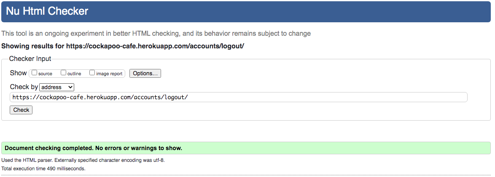
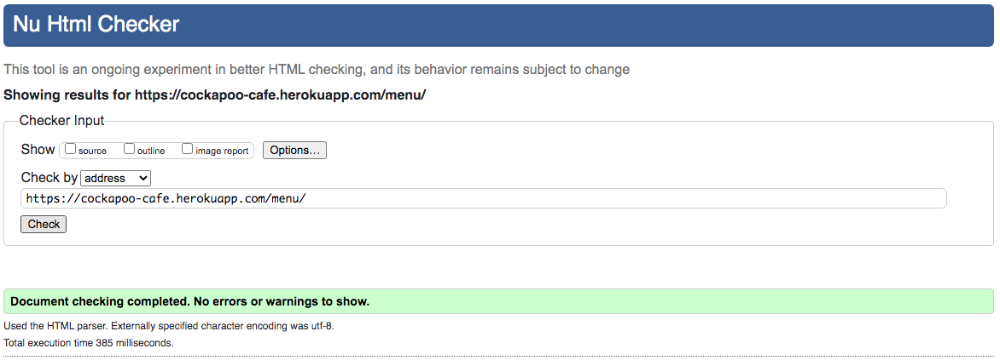
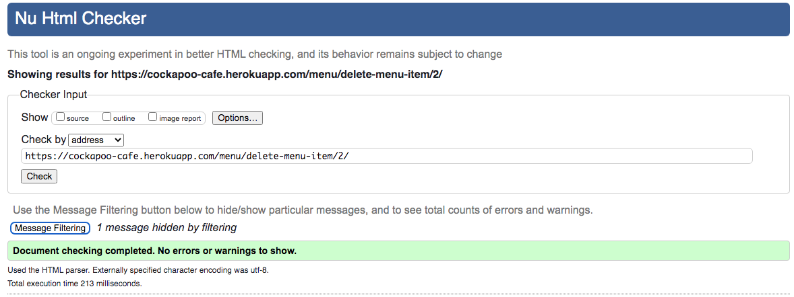
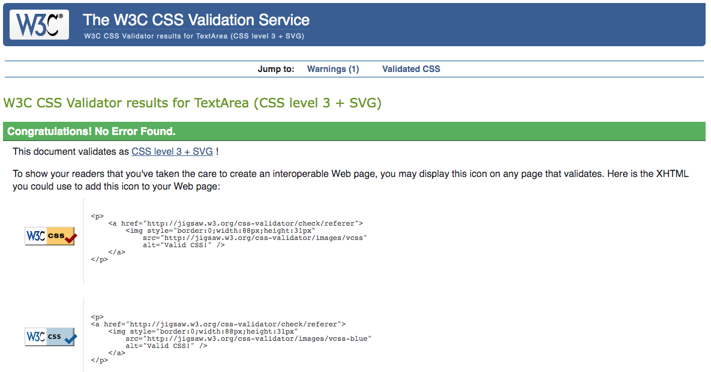
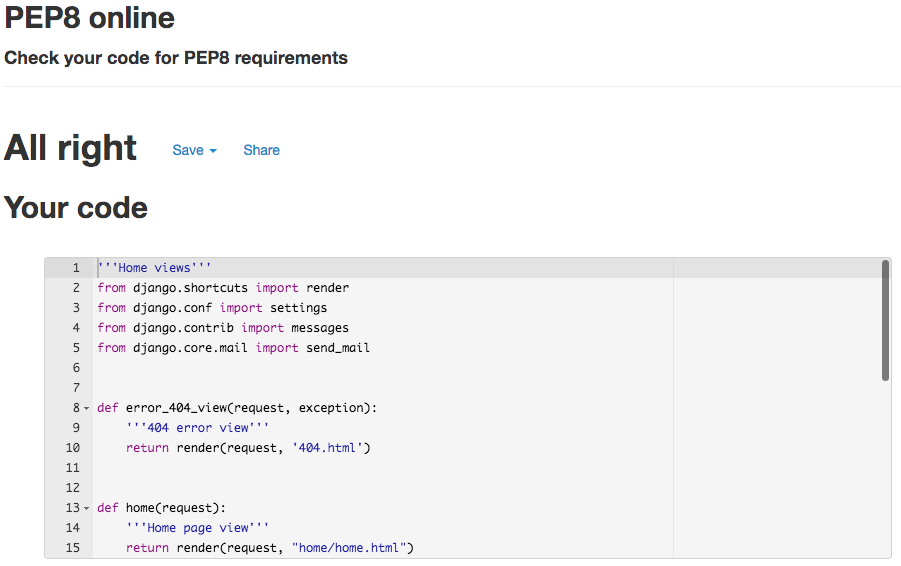
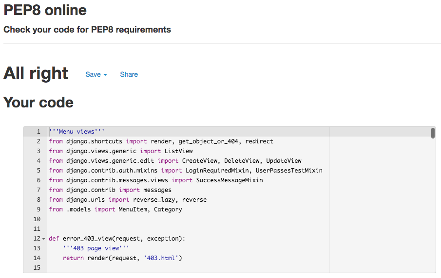

# Test Results

## Validator Results

### HTML Results:
#### Home
* Home Page
 
* Contact Page
 
* Sign up Page
 
* Sign in Page
 
* sign out Page

#### Menu
* Menu Category Page
 
* Create Menu Category Page
 
* Update Menu Category Page
 
* Delete Menu Category Page
 
* Menu Item Page
 
* Create Menu Item Page
 
* Update Menu Item Page
 
* Delete Menu Item Page
 
#### Review
* Review Page
 
* Create Review Page
 
* Update Review Page
 
* Delete Review Page
 
* Approve Review Page
 
#### Reservation
* Reservation Page
 
* Create Reservation Page
 
* Update Reservation Page
 
* Delete Reservation Page
 
* Approve Reservation Page
 
### CSS Results:
 

### JavaScript Results:
 

### Python Results:
#### Home App
 
#### Menu App
 
 
#### Review App
 
 
#### Reservation App
 
 

## Manually Testing Functionality
### **Navigation**

|Element               |Action|Expected Result               |Pass/Fail|
|:-------------         |:----|:----------------------------------|:---|
| **NavBar**            |                                         |    |
|Site Name (logo area)  |Click|Redirect to home                   |Pass|
|                       |     |                                   |    |
|Home                   |Click|Redirect to home                   |Pass|
|                       |     |                                   |    |
|Reservation Link       |Click|Redirect to register page          |Pass|
|                       |     |(If user not in session)           |Pass|
|                       |Click|Redirect to reservation page       |Pass|
|                       |     |(If user in session)               |Pass|
|ADMIN RESERVATION LINK |     |                                   |Pass|
|(Reservations dropdown)|Click|Redirect to reservation page       |Pass|
|(Approve Res dropdown) |Click|Redirect to approve reservations   |Pass|
|                       |     |                                   |    |
|Log In Link (dropdown) |Click|Redirect to log in page            |Pass|
|                       |     |(Not visible if user in session)   |Pass|
|Register Link(dropdown)|Click|Redirect to add_product page       |Pass|
|                       |     |(Not visible if user in session)   |Pass|
|Review Link            |Click|Redirect to review page            |Pass|
|ADMIN REVIEW LINK      |     |                                   |    |
|(Review dropdown)      |Click|Redirect to review page            |Pass|
|(Approve Rev dropdown) |Click|Redirect to approve review         |Pass|
|                       |     |                                   |    |
|Contact Link           |Click|Redirect to contact page           |Pass|
|                       |     |                                   |Pass|
|Menu Link              |Click|Redirect to menu page              |Pass|
|ADMIN MENU LINK        |     |                                   |    |
|(Menu dropdown)        |Click|Redirect to menu page              |Pass|
|(Manage Menu dropdown) |Click|Redirect to Manage menu Items page |Pass|
|(Create Menu Cat dd)   |Click|Redirect to Create menu Category pg|Pass|
|(Create Menu Item dd)  |Click|Redirect to Create menu Item pg    |Pass|
|                       |     |                                   |    |
| **SideNav**           |     |                                   |    |
|Hamburger Icon         |Click|Open Sidenav                       |Pass|
|Site Name (logo area)  |Click|Redirect to home                   |Pass|
|                       |     |                                   |    |
|Home                   |Click|Redirect to home                   |Pass|
|                       |     |                                   |    |
|Reservation Link       |Click|Redirect to register page          |Pass|
|                       |     |(If user not in session)           |Pass|
|                       |Click|Redirect to reservation page       |Pass|
|                       |     |(If user in session)               |Pass|
|ADMIN RESERVATION LINK |     |                                   |Pass|
|(Reservations dropdown)|Click|Redirect to reservation page       |Pass|
|(Approve Res dropdown) |Click|Redirect to approve reservations   |Pass|
|                       |     |                                   |    |
|Log In Link (dropdown) |Click|Redirect to log in page            |Pass|
|                       |     |(Not visible if user in session)   |Pass|
|Register Link(dropdown)|Click|Redirect to add_product page       |Pass|
|                       |     |(Not visible if user in session)   |Pass|
|Review Link            |Click|Redirect to review page            |Pass|
|ADMIN REVIEW LINK      |     |                                   |    |
|(Review dropdown)      |Click|Redirect to review page            |Pass|
|(Approve Rev dropdown) |Click|Redirect to approve review         |Pass|
|                       |     |                                   |    |
|Contact Link           |Click|Redirect to contact page           |Pass|
|                       |     |                                   |Pass|
|Menu Link              |Click|Redirect to menu page              |Pass|
|ADMIN MENU LINK        |     |                                   |    |
|(Menu dropdown)        |Click|Redirect to menu page              |Pass|
|(Manage Menu dropdown) |Click|Redirect to Manage menu Items page |Pass|
|(Create Menu Cat dd)   |Click|Redirect to Create menu Category pg|Pass|
|(Create Menu Item dd)  |Click|Redirect to Create menu Item pg    |Pass|
|                       |     |                                   |    |
| **Footer**            |     |                                   |    |
|*Socials*              |     |                                   |    |
|Facebook Link          |Click|Open on external page              |Pass|
|Instagram Link         |Click|Open on external page              |Pass|
|Twitter Link           |Click|Open on external page              |Pass|

---
### **Home Page**
| Element               |Action| Expected Result            | Pass/Fail|
|:-------------         |:-----|:-----                            |:---|
|Reservation Link       |Click |Redirect to register page         |Pass|
|                       |      |(If user not in session)          |Pass|
|                       |Click |Redirect to reservation page      |Pass|
|                       |      |(If user in session)              |Pass|

---
### **Reservation Page**
| Element               |Action| Expected Result            | Pass/Fail|
|:-------------         |:-----|:-----                            |:---|
|Make Reservation Link  |Click |Redirect to create reservation pg |Pass|
|                       |      |(If user in session)              |Pass|
|                       |Click |Redirect to reservation page      |Pass|
|                       |      |(If user in session)              |Pass|
|                       |      |                                  |    |
|Update Reservation Link|Click |Redirect to Update reservation pg |Pass|
|                       |      |(If user in session)              |    |
|                       |      |                                  |    |
|Delete Reservation Link|Click |Redirect to Delete reservation pg |Pass|
|                       |      |(If user in session)              |    |
|ADMIN APPROVE RESERVATION     |                                  |    |
|Approve Reservation    |Click |Redirect to Approve reservation pg|Pass|
|                       |      |(If admin user in session)        |Pass|
|                       |      |                                  |    |
|Create Reservation     |Form  |Message appears to inform the user|Pass|
|Messages appear        |Post  |a reservation has been created    |Pass|
|                       |      |                                  |    |
|Update Reservation     |Form  |Message appears to inform the user|Pass|
|Messages appear        |Post  |a reservation has been Updated    |Pass|
|                       |      |                                  |    |
|Deleted Reservation    |Form  |Message appears to inform the user|Pass|
|Messages appear        |Post  |a reservation has been Deleted    |Pass|

---
### **Create Reservation Page**
| Element               |Action| Expected Result            | Pass/Fail|
|:-------------         |:-----|:-----                            |:---|
|**Form**               |      |                                  |    |
|First name field       |Filled|Field must be filled in or warning|Pass|
|                       |      |                                  |    |
|Last name field        |Filled|Field must be filled in or warning|Pass|
|                       |      |                                  |    |
|Email field            |Filled|Field must be filled and comply   |Pass|
|                       |      |or warning will appear            |    |
|Phone field            |Filled|Field not needed but must comply  |Pass|
|                       |      |if it is or warning will appear   |    |
|Time field             |Filled|Field must be filled default set  |Pass|
|                       |      |                                  |    |
|Date field             |Filled|Field must be selected from       |Pass|
|                       |      |dropdown selection and in future  |Pass|
|Information field      |Filled|Field can be left blank           |Pass|
|                       |      |but placeholder set               |    |
|Submit Link            |Click |Redirect to reservation pg and    |Pass|
|                       |      |make reservation                  |Pass|
|Cancel Link            |Click |Redirect to reservation pg and    |Pass|
|                       |      |cancel reservation                |Pass|

---
### **Update Reservation Page**
| Element               |Action| Expected Result            | Pass/Fail|
|:-------------         |:-----|:-----                            |:---|
|**Form**               |      |                                  |    |
|First name field       |Filled|Field must be filled in or warning|Pass|
|                       |      |                                  |    |
|Last name field        |Filled|Field must be filled in or warning|Pass|
|                       |      |                                  |    |
|Email field            |Filled|Field must be filled and comply   |Pass|
|                       |      |or warning will appear            |    |
|Phone field            |Filled|Field not needed but must comply  |Pass|
|                       |      |if it is or warning will appear   |    |
|Time field             |Filled|Field must be filled default set  |Pass|
|                       |      |                                  |    |
|Date field             |Filled|Field must be selected from       |Pass|
|                       |      |dropdown selection and in future  |Pass|
|Information field      |Filled|Field can be left blank           |Pass|
|                       |      |but placeholder set               |    |
|Submit Link            |Click |Redirect to reservation pg and    |Pass|
|                       |      |make reservation                  |Pass|
|Cancel Link            |Click |Redirect to reservation pg and    |Pass|
|                       |      |cancel reservation                |Pass|

---
### **Delete Reservation Page**
| Element               |Action| Expected Result            | Pass/Fail|
|:-------------         |:-----|:-----                            |:---|
|**Form**               |      |                                  |    |
|Confirm Link           |Click |Redirect to reservation pg and    |Pass|
|                       |      |delete reservation                |Pass|
|Cancel Link            |Click |Redirect to reservation pg and    |Pass|
|                       |      |cancel reservation deletion       |Pass|

---
### **Admin Approve Reservation Page**
| Element               |Action| Expected Result            | Pass/Fail|
|:-------------         |:-----|:-----                            |:---|
|**Form**               |      |                                  |    |
|Approve Reservation Link|Click|Approve reservation and show msg  |Pass|
|                       |      |it has been approved, reservation |Pass|
|                       |      |will not appear on page           |Pass|
|                       |      |It will be approved on reservation|Pass|
|                       |      |page highlighted in green         |Pass|
|Reject Reservation Link|Click |Reject reservation and show msg   |Pass|
|                       |      |it has been rejected, reservation |Pass|
|                       |      |will not appear on page           |Pass|
|                       |      |It will be approved on reservation|Pass|
|                       |      |page highlighted in red           |Pass|
|Back to Reservation Link|Click|Redirects back to reservation pg  |Pass|

---
### **Review Page**
| Element               |Action| Expected Result            | Pass/Fail|
|:-------------         |:-----|:-----                            |:---|
|Leave Review Link      |Click |Redirect to create review pg      |Pass|
|                       |      |(If user in session)              |Pass|
|                       |      |                                  |    |
|Update Review Link     |Click |Redirect to Update review pg      |Pass|
|                       |      |(If user in session)              |    |
|                       |      |                                  |    |
|Delete Review Link     |Click |Redirect to Delete review pg      |Pass|
|                       |      |(If user in session)              |    |
|ADMIN APPROVE REVIEW   |      |                                  |    |
|Approve Review         |Click |Redirect to Approve review pg     |Pass|
|                       |      |(If admin user in session)        |Pass|
|                       |      |                                  |    |
|Create Review          |Form  |Message appears to inform the user|Pass|
|Messages appear        |Post  |a review has been created         |Pass|
|                       |      |                                  |    |
|Update Review          |Form  |Message appears to inform the user|Pass|
|Messages appear        |Post  |a review has been Updated         |Pass|
|                       |      |                                  |    |
|Deleted Review         |Form  |Message appears to inform the user|Pass|
|Messages appear        |Post  |a review has been Deleted         |Pass|
|                       |      |                                  |    |
|Like Button            |Click |if clicked a like is counted      |Pass|
|                       |      |and button changes to unlike      |Pass|
|                       |      |                                  |    |
|Unlike Button          |Click |if clicked a like is uncounted    |Pass|
|                       |      |and button changes to like        |Pass|

---
### **Create Review Page**
| Element               |Action| Expected Result            | Pass/Fail|
|:-------------         |:-----|:-----                            |:---|
|**Form**               |      |                                  |    |
|Title field            |Filled|Field has default no_title set    |Pass|
|                       |      |                                  |    |
|Body field             |Filled|Field must be filled in or warning|Pass|
|                       |      |                                  |    |
|Image field            |Select|User can choose an image or not   |Pass|
|                       |      |a default image will be set       |Pass|
|Submit Link            |Click |Redirect to review pg and         |Pass|
|                       |      |make review                       |Pass|
|Cancel Link            |Click |Redirect to review pg and         |Pass|
|                       |      |cancel review                     |Pass|

---
### **Update Review Page**
| Element               |Action| Expected Result            | Pass/Fail|
|:-------------         |:-----|:-----                            |:---|
|**Form**               |      |                                  |    |
|Title field            |Filled|Field has default no_title set    |Pass|
|                       |      |                                  |    |
|Body field             |Filled|Field must be filled in or warning|Pass|
|                       |      |                                  |    |
|Image field            |Select|User can choose an image or not   |Pass|
|                       |      |a default image will be set       |Pass|
|Submit Link            |Click |Redirect to review pg and         |Pass|
|                       |      |make review                       |Pass|
|Cancel Link            |Click |Redirect to review pg and         |Pass|
|                       |      |cancel review                     |Pass|

---
### **Delete Review Page**
| Element               |Action| Expected Result            | Pass/Fail|
|:-------------         |:-----|:-----                            |:---|
|**Form**               |      |                                  |    |
|Confirm Link           |Click |Redirect to review pg and         |Pass|
|                       |      |delete review                     |Pass|
|Cancel Link            |Click |Redirect to review pg and         |Pass|
|                       |      |cancel review deletion            |Pass|

---
### **Admin Approve Review Page**
| Element               |Action| Expected Result            | Pass/Fail|
|:-------------         |:-----|:-----                            |:---|
|**Form**               |      |                                  |    |
|Approve Review Link    |Click |Approve review and show msg       |Pass|
|                       |      |it has been approved, review      |Pass|
|                       |      |will not appear on page           |Pass|
|                       |      |It will be approved on review     |Pass|
|                       |      |page                              |Pass|
|Reject Reservation Link|Click |Reject review and show msg        |Pass|
|                       |      |it has been rejected, review      |Pass|
|                       |      |will not appear on page           |Pass|
|                       |      |It will be not be approved on     |Pass|
|                       |      |review page and will be deleted   |Pass|
|Back to Reviews Link   |Click |Redirects back to the review page |Pass|

---
### **Contact Page**
| Element               |Action| Expected Result            | Pass/Fail|
|:-------------         |:-----|:-----                            |:---|
|Sent Email Form        |Filled|Fields must be filled in          |Pass|
|                       |      |                                  |    |
|Send Message Button    |Click |Submits contact form and email    |Pass|
|                       |      |is sent to site owner             |Pass|
|                       |      |Message appears to inform user    |Pass|
|                       |      |the form was sent                 |Pass|
|Google Map             |      |Map displays on page              |Pass|

---
### **Menu Page**
| Element               |Action| Expected Result            | Pass/Fail|
|:-------------         |:-----|:-----                            |:---|
|Hot Drinks menu Link   |Click |Redirect to Hot dirnks menu pg    |Pass|
|                       |      |                                  |    |
|Cold Drinks menu Link  |Click |Redirect to Cold dirnks menu pg   |Pass|
|                       |      |                                  |    |
|Cakes menu Link        |Click |Redirect to Cakes menu pg         |Pass|
|                       |      |                                  |    |
|Sandwich menu Link     |Click |Redirect to Sandwich menu pg      |Pass|
|                       |      |                                  |    |
|Further menu Link      |Click |Redirect to that menu pg          |Pass|
|(if created by admin)  |      |                                  |Pass|

---
### **Menu Category Page**
| Element               |Action| Expected Result            | Pass/Fail|
|:-------------         |:-----|:-----                            |:---|
|Back to Main menu Link |Click |Redirect to main menu pg          |Pass|
|                       |      |                                  |    |
|Like Button            |Click |if clicked a like is counted      |Pass|
|                       |      |and button changes to unlike      |Pass|
|                       |      |(if user logged in)               |    |
|Unlike Button          |Click |if clicked a like is uncounted    |Pass|
|                       |      |and button changes to like        |Pass|
|                       |      |(if user logged in)               |    |

---
### **Admin Menu Page**
| Element               |Action| Expected Result            | Pass/Fail|
|:-------------         |:-----|:-----                            |:---|
|Hot Drinks menu Link   |Click |Redirect to Hot dirnks menu pg    |Pass|
|                       |      |                                  |    |
|Cold Drinks menu Link  |Click |Redirect to Cold dirnks menu pg   |Pass|
|                       |      |                                  |    |
|Cakes menu Link        |Click |Redirect to Cakes menu pg         |Pass|
|                       |      |                                  |    |
|Sandwich menu Link     |Click |Redirect to Sandwich menu pg      |Pass|
|                       |      |                                  |    |
|Further menu Link      |Click |Redirect to that menu pg          |Pass|
|                       |      |                                  |    |
|Create Category Link   |Click |Redirect to Create category pg    |Pass|
|                       |      |(Admin only)                      |    |
|Update Category Link   |Click |Redirect to update category pg    |Pass|
|                       |      |(Admin only)                      |    |
|Delete Category Link   |Click |Redirect to delete category pg    |Pass|
|                       |      |(Admin only)                      |    |
|Create Menu Items Link |Click |Redirect to Menu items pg         |Pass|
|                       |      |(Admin only)                      |    |

---
### **Admin Create Menu Category Page**
| Element               |Action| Expected Result            | Pass/Fail|
|:-------------         |:-----|:-----                            |:---|
|**Form**               |      |                                  |    |
|Name field             |Filled|Field must be filled in or warning|Pass|
|                       |      |                                  |    |
|Description field      |Filled|Field must be filled in or warning|Pass|
|                       |      |                                  |    |
|Submit Link            |Click |Redirect to menu pg and           |Pass|
|                       |      |make Category                     |Pass|
|Cancel Link            |Click |Redirect to menu pg and           |Pass|
|                       |      |cancel category creation          |Pass|

---
### **Admin Update Menu Category Page**
| Element               |Action| Expected Result            | Pass/Fail|
|:-------------         |:-----|:-----                            |:---|
|**Form**               |      |                                  |    |
|Name field             |Filled|Field must be filled in or warning|Pass|
|                       |      |                                  |    |
|Description field      |Filled|Field must be filled in or warning|Pass|
|                       |      |                                  |    |
|Submit Link            |Click |Redirect to menu pg and           |Pass|
|                       |      |make Category                     |Pass|
|Cancel Link            |Click |Redirect to menu pg and           |Pass|
|                       |      |cancel category creation          |Pass|

---
### **Admin Delete Menu Category Page**
| Element               |Action| Expected Result            | Pass/Fail|
|:-------------         |:-----|:-----                            |:---|
|                       |      |                                  |    |
|Confirm Link           |Click |Redirect to menu pg and           |Pass|
|                       |      |delete category (no items left)   |Pass|
|Cancel Link            |Click |Redirect to menu pg and           |Pass|
|                       |      |cancel category deletion          |Pass|

---
### **Admin Menu Item Page**
| Element               |Action| Expected Result            | Pass/Fail|
|:-------------         |:-----|:-----                            |:---|
|                       |      |                                  |    |
|Create Menu Item Link  |Click |Redirect to Create Menu Item pg   |Pass|
|                       |      |(Admin only)                      |    |
|Update Item Link       |Click |Redirect to update Item pg        |Pass|
|                       |      |(Admin only)                      |    |
|Delete Item Link       |Click |Redirect to delete Item pg        |Pass|
|                       |      |(Admin only)                      |    |
|Create Menu Items Link |Click |Redirect to Menu items pg         |Pass|
|                       |      |(Admin only)                      |    |
|Back Link              |Click |Redirect to main Menu pg          |Pass|

---
### **Admin Create Menu Item Page**
| Element               |Action| Expected Result            | Pass/Fail|
|:-------------         |:-----|:-----                            |:---|
|**Form**               |      |                                  |    |
|Name field             |Filled|Field must be filled in or warning|Pass|
|                       |      |                                  |    |
|Description field      |Filled|Field must be filled in or warning|Pass|
|                       |      |                                  |    |
|Image field            |Select|User can choose an image or not   |Pass|
|                       |      |a default image will be set       |Pass|
|Category field         |Select|User can choose the category of   |Pass|
|                       |      |the menu item or will be warned   |Pass|
|Price field            |Filled|Field must be filled default set  |Pass|
|                       |      |                                  |    |
|Submit Link            |Click |Redirect to menu Item pg and      |Pass|
|                       |      |make Menu item                    |Pass|
|Cancel Link            |Click |Redirect to menu Item pg and      |Pass|
|                       |      |cancel Menu Item creation         |Pass|

---
### **Admin Update Menu Item Page**
| Element               |Action| Expected Result            | Pass/Fail|
|:-------------         |:-----|:-----                            |:---|
|**Form**               |      |                                  |    |
|Name field             |Filled|Field must be filled in or warning|Pass|
|                       |      |                                  |    |
|Description field      |Filled|Field must be filled in or warning|Pass|
|                       |      |                                  |    |
|Image field            |Select|User can choose an image or not   |Pass|
|                       |      |a default image will be set       |Pass|
|Category field         |Select|User can choose the category of   |Pass|
|                       |      |the menu item or will be warned   |Pass|
|Price field            |Filled|Field must be filled default set  |Pass|
|                       |      |                                  |    |
|Submit Link            |Click |Redirect to menu Item pg and      |Pass|
|                       |      |make Menu item                    |Pass|
|Cancel Link            |Click |Redirect to menu Item pg and      |Pass|
|                       |      |cancel Menu Item creation         |Pass|

---
### **Admin Delete Menu Item Page**
| Element               |Action| Expected Result            | Pass/Fail|
|:-------------         |:-----|:-----                            |:---|
|                       |      |                                  |    |
|Confirm Link           |Click |Redirect to menu item pg and      |Pass|
|                       |      |delete Menu Item                  |Pass|
|Cancel Link            |Click |Redirect to menu item pg and      |Pass|
|                       |      |cancel Menu Item deletion         |Pass|

---
### **Sign Out Page**
| Element               |Action| Expected Result            | Pass/Fail|
|:-------------         |:-----|:-----                            |:---|
|                       |      |                                  |    |
|Sign Out Link          |Click |Redirect to home page             |Pass|
|                       |      |                                  |Pass|
|Cancel Link            |Click |Redirect to home page             |Pass|
|                       |      |                                  |    |

---
### **Sign In Page**
| Element               |Action| Expected Result            | Pass/Fail|
|:-------------         |:-----|:-----                            |:---|
|Username field         |Select|User must fill in username or     |Pass|
|                       |      |get a warning message             |Pass|
|Password field         |Filled|User must fill in password or     |Pass|
|                       |      |get a warning message             |Pass|
|                       |      |                                  |    |
|Sign In Link           |Click |Redirect to home page             |Pass|
|                       |      |                                  |    |
|Cancel Link            |Click |Redirect to home page             |Pass|
|                       |      |                                  |    |

---
### **Register Page**
| Element               |Action| Expected Result            | Pass/Fail|
|:-------------         |:-----|:-----                            |:---|
|Username field         |Select|User must fill in username or     |Pass|
|                       |      |get a warning message             |Pass|
|Email field            |Filled|User can choose to enter email    |Pass|
|                       |      |                                  |Pass|
|Password field         |Filled|User must fill in password or     |Pass|
|                       |      |get a warning message             |Pass|
|                       |      |                                  |    |
|Password (again) field |Filled|User must fill in password and    |Pass|
|                       |      |match or get a warning message    |Pass|
|Register Link          |Click |Redirect to home page             |Pass|
|                       |      |                                  |    |
|Cancel Link            |Click |Redirect to home page             |Pass|
|                       |      |                                  |    |

