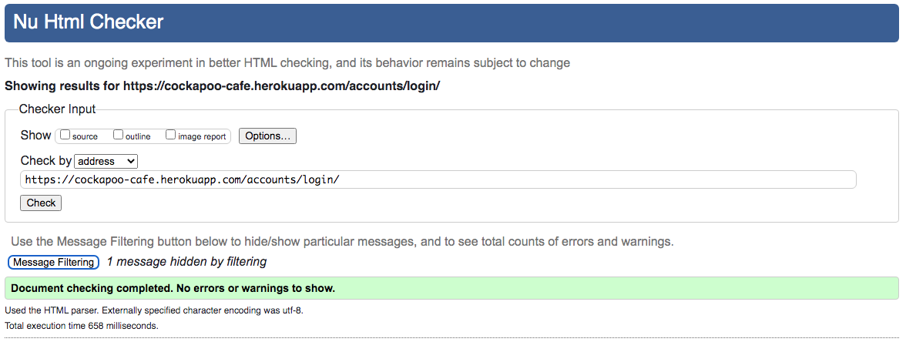
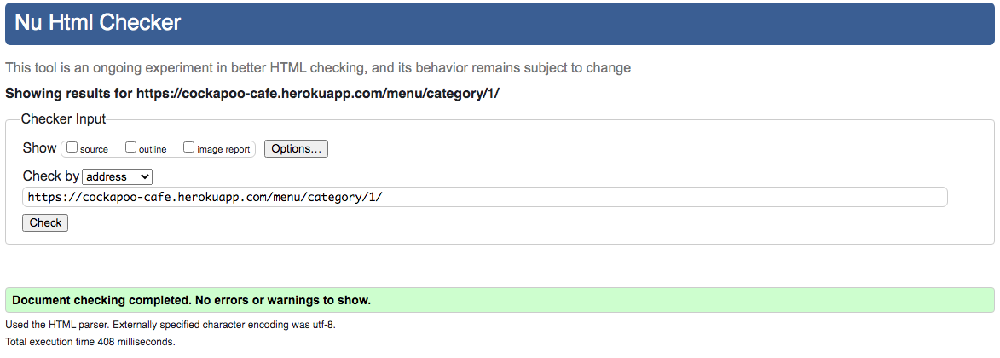
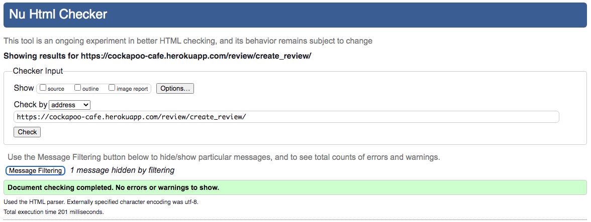
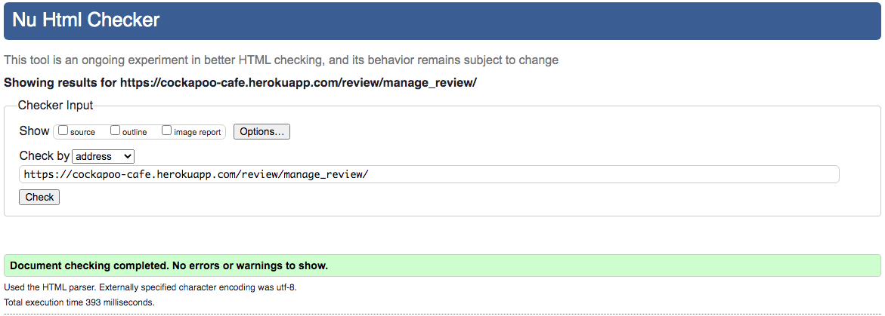
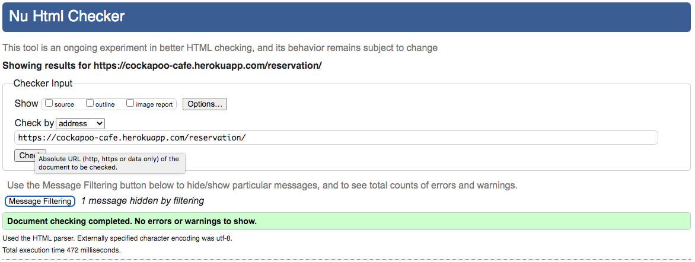
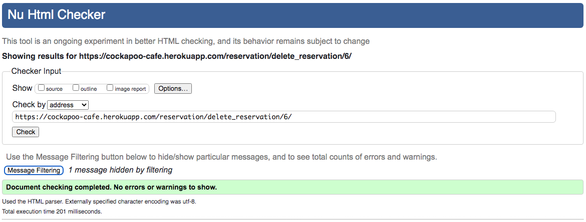
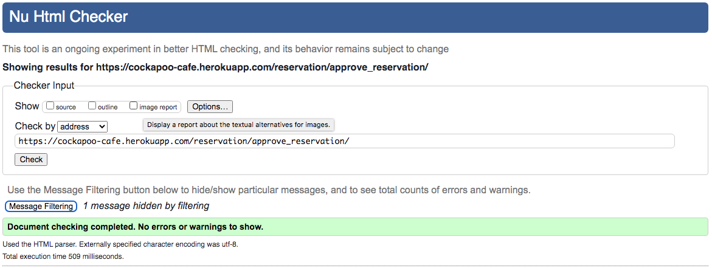
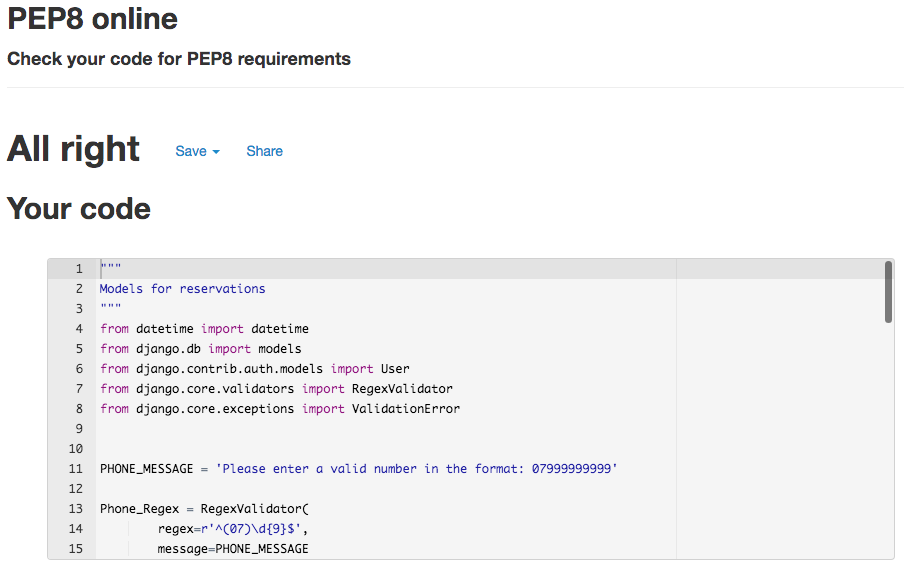
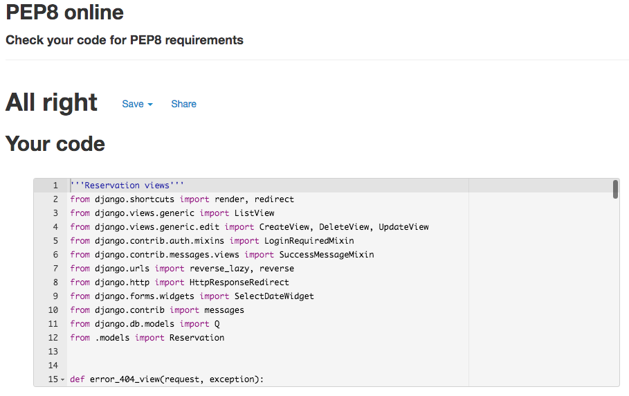

# Test Results

## Validator Results

### HTML Results:
#### Home
* Home Page
 
* Contact Page
 
* Sign up Page
 
* Sign in Page
 
* sign out Page

#### Menu
* Menu Category Page
 
* Create Menu Category Page
 
* Update Menu Category Page
 
* Delete Menu Category Page
 
* Menu Item Page
 
* Create Menu Item Page
 
* Update Menu Item Page
 
* Delete Menu Item Page
 
#### Review
* Review Page
 
* Create Review Page
 
* Update Review Page
 
* Delete Review Page
 
* Approve Review Page
 
#### Reservation
* Reservation Page
 
* Create Reservation Page
 
* Update Reservation Page
 
* Delete Reservation Page
 
* Approve Reservation Page
 
### CSS Results:
 

### JavaScript Results:
 

### Python Results:
#### Home App
 
#### Menu App
 
 
#### Review App
 
 
#### Reservation App
 
 