# Full Testing
## Contents
+ [Validator Testing](#validator-testing)
<!-- + [Lighthouse Testing](#lighthouse-testing) -->
<!-- + [PowerMapper Compatibility](#powermapper-compatibility) -->
+ [Testing From User Stories](#testing-from-user-stories)
<!-- + [Automated Testing](#automated-testing) -->
+ [Manually Testing Functionality](#manually-testing-functionality)
+ [Responsive Testing](#responsive-testing)
+ [Bugs and Fixes](#bugs-and-fixes)
+ [Known Bugs](#known-bugs)
---
---

# Test Results

## Validator Results

### HTML Results:
#### Home
* Home Page
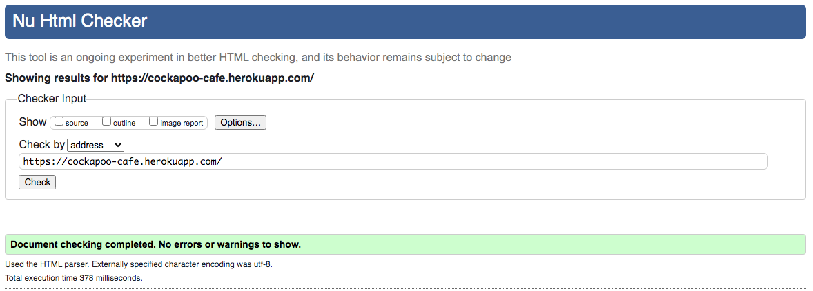 
* Contact Page
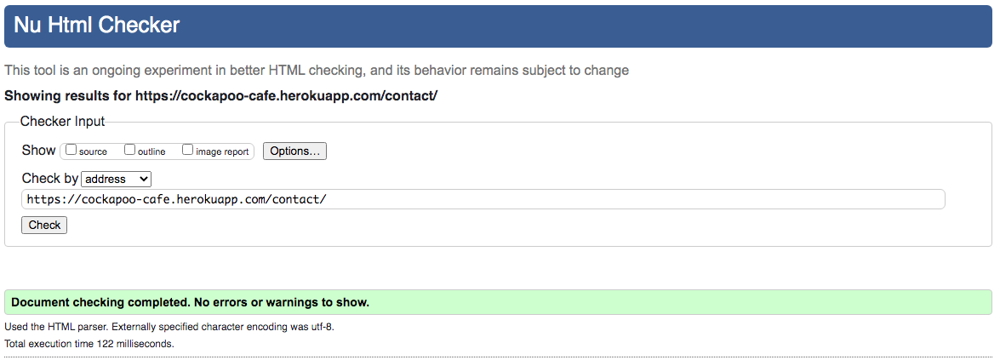 
* Sign up Page
 
* Sign in Page
 
* sign out Page

#### Menu
* Menu Category Page
 
* Create Menu Category Page
 
* Update Menu Category Page
 
* Delete Menu Category Page
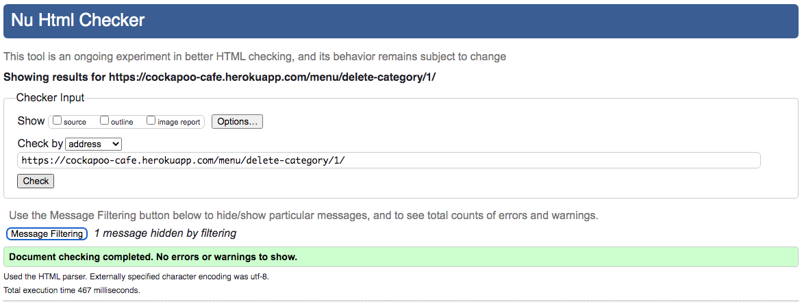 
* Menu Item Page
 
* Create Menu Item Page
 
* Update Menu Item Page
 
* Delete Menu Item Page
 
#### Review
* Review Page
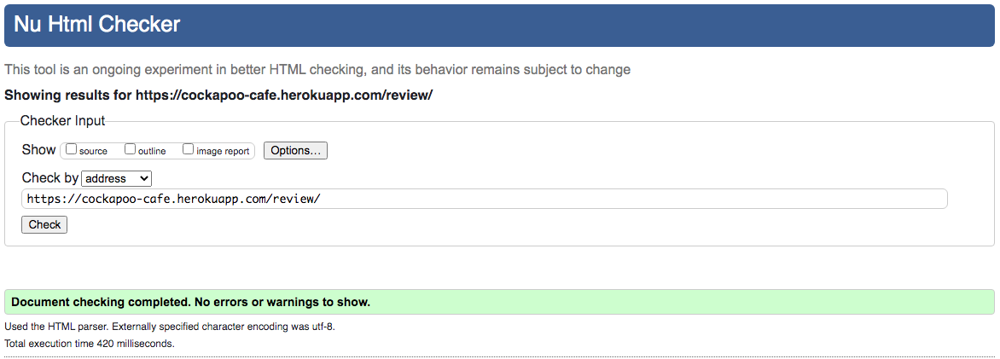 
* Create Review Page
 
* Update Review Page
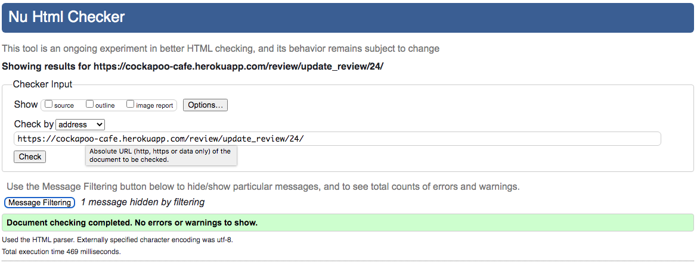 
* Delete Review Page
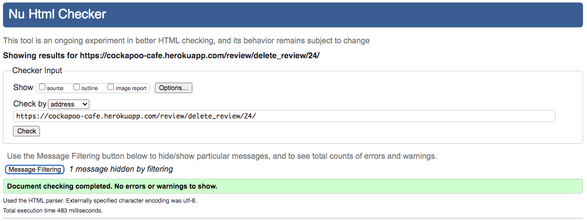 
* Approve Review Page
 
#### Reservation
* Reservation Page
 
* Create Reservation Page
 
* Update Reservation Page
 
* Delete Reservation Page
 
* Approve Reservation Page
 
### CSS Results:
 

### JavaScript Results:
 

### Python Results:
#### Home App
 
#### Menu App
 
 
#### Review App
 
 
#### Reservation App
 
 

### Testing User Stories

1. As a new user I can easily register for the site so that I can interact with the site content.

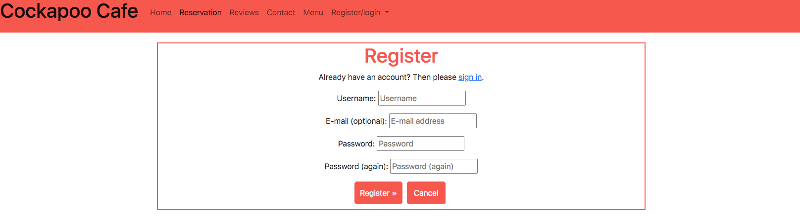

* When the user navigates to the register button in the navigation bar or clicks the reservation tab, if not logged in, they are directed to the register page. Filling in the form is quick and easy. Once filled out the user is navigated back to the home page where they are displayed a message to say they have registered for the site.
* This has been tested manually to ensure it works as it should.

2. As a returning user I can login to the site so that I can interact with the site content.

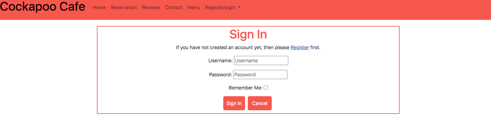

* If the user is a returning user they will be able to sign in using the signin tab in the navigation bar. They are given a message to say that they are now signed in.
* This has been tested manually to ensure it works as it should.

3. As a site admin I can create new items to add to the menu so that I can change the options on offer.

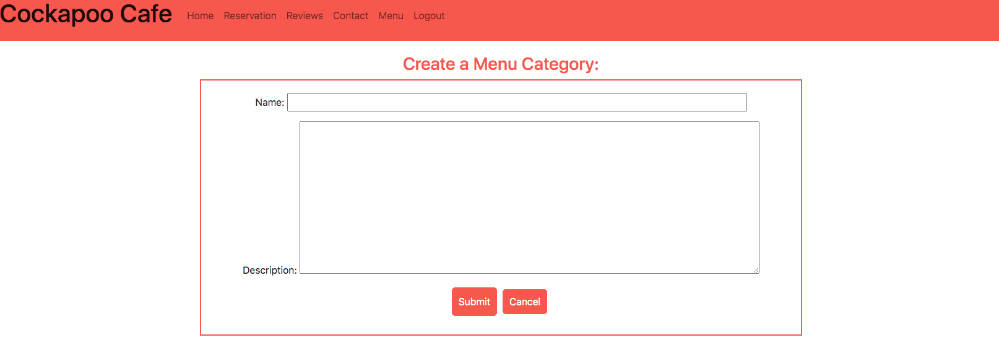

* The admin can create a new menu category and are displayed a message to let them know that the category has been created.
* This has been tested manually to ensure it works as it should.

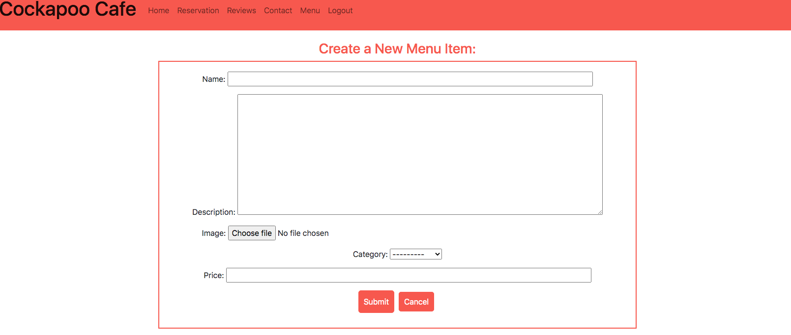

* The admin can create a new menu Item and are displayed a message to let them know that the menu item has been created.
* This has been tested manually to ensure it works as it should.

4. As a site admin I can Edit/ Delete items on the menu so that Keep the menu up to date.

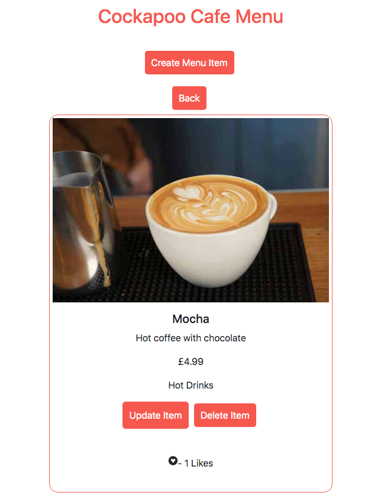

* By clicking the relevant button the admin can update or delete the selected menu item and are displayed a message to let them know that the menu item has been updated/deleted.
* This has been tested manually to ensure it works as it should.

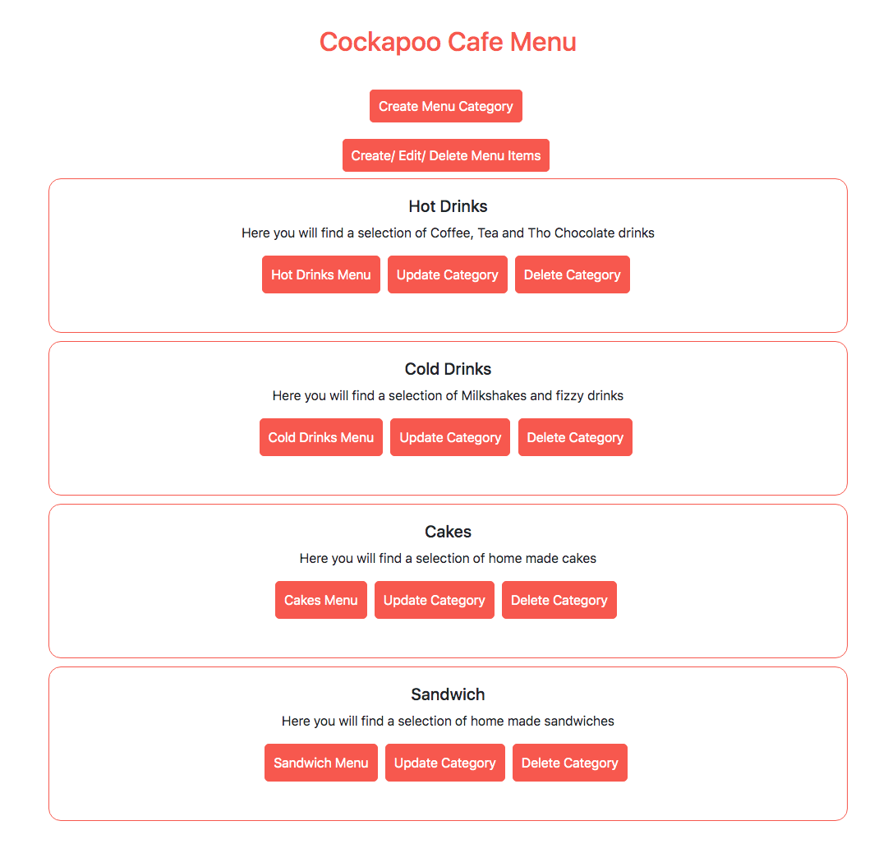

* By clicking the relevant button the admin can update or delete the selected menu category and are displayed a message to let them know that the category has been updated/deleted..
* This has been tested manually to ensure it works as it should.

5. As a site admin/user I can see the number of likes a menu item has so that I can see how popular it is.

* The user can see how many likes the menu item has and if logged in they can like the item and if they liked the item by mistake they can unlike the item. This will increase or decrease the unmber of likes the item has.
* This has been tested manually to ensure it works as it should.

6. As a User I can Create, edit and delete a reservation so that I can manage the reservation.

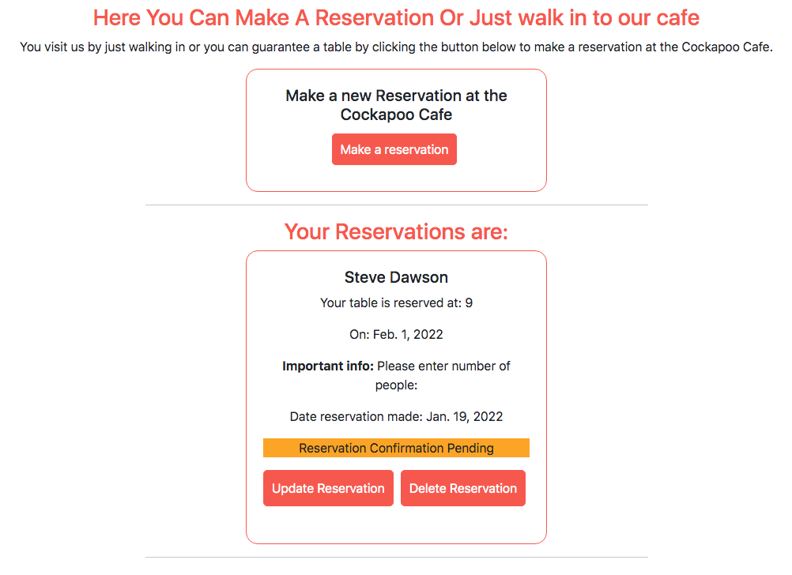

* When the logged in user navigates to the reservation page, they will see a card to create a reservation. once created they will get a message to say it has been created and then will be able to update and delete the reservation by selecting the appropriate button. The reservation also has a traffic light system to inform the user if their reservation is pending, accepted or rejected. The user will be displayed a message each time they create/ update or delete a reservation.
* This has been tested manually to ensure it works as it should.

7. As a site admin I can approve/disapprove reservations so that to make sure that there is enough room for the guests.

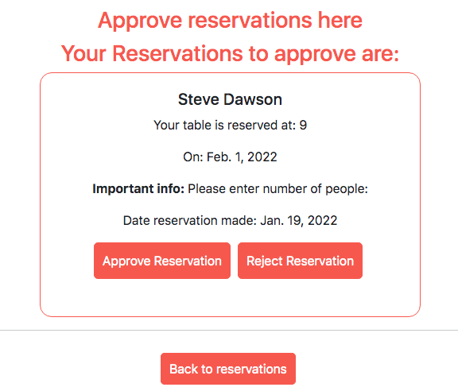

* The admin is able to approve or reject reservations by selecting the appropriate button. Once done the reservation will be removed from this page and the reservation traffic light system will change accordingly, informing the user and the admin that the reservation has been accepted or rejected. The admin will be displayed a message to inform them that the reservation has been accepted or rejected.
* This has been tested manually to ensure it works as it should.

8. As a User I can Create, edit and delete a review of my experience so that I can share my experience of the cafe with future users.

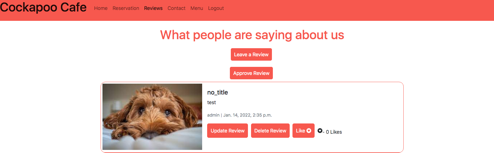

* The user is able to create a review of the cafe by clicking the button Leave a Review. Once they have completed the form and submitted the review will be sent for approval to the admin and will not show in the review page. Once the admin has approved the review the review will be displayed on the review page. The user will then be able to Update or delete their review by selecting the appropriate button on their review. The user will be displayed a message each time they create/ update or delete a review.
* This has been tested manually to ensure it works as it should.

9. As a User I can Like/unlike fellow users reviews so that I can interact with the sites users.

* The user is able to like and unlike reviews of the cafe by clicking the button Like/Unlike. Their like will be added to any previous likes and change the number of likes that review has.
* This has been tested manually to ensure it works as it should.

10. As a site Admin I can approve/disapprove reviews so that I can filter objectionable comments.

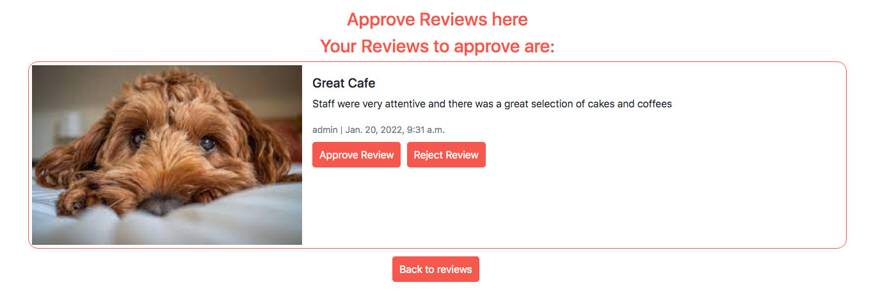

* When the user has left a review, the review will not be displayed until it has been accepted by the site admin. The site admin has the ability to approve or reject the review by going to the manage review page via the button only visable to the admin and then selecting the appropriate button to accept or reject the review. If the review is rejected it will be deleted.
* This has been tested manually to ensure it works as it should.

11. As a User I can See the location of the cafe so that I know how to get there.

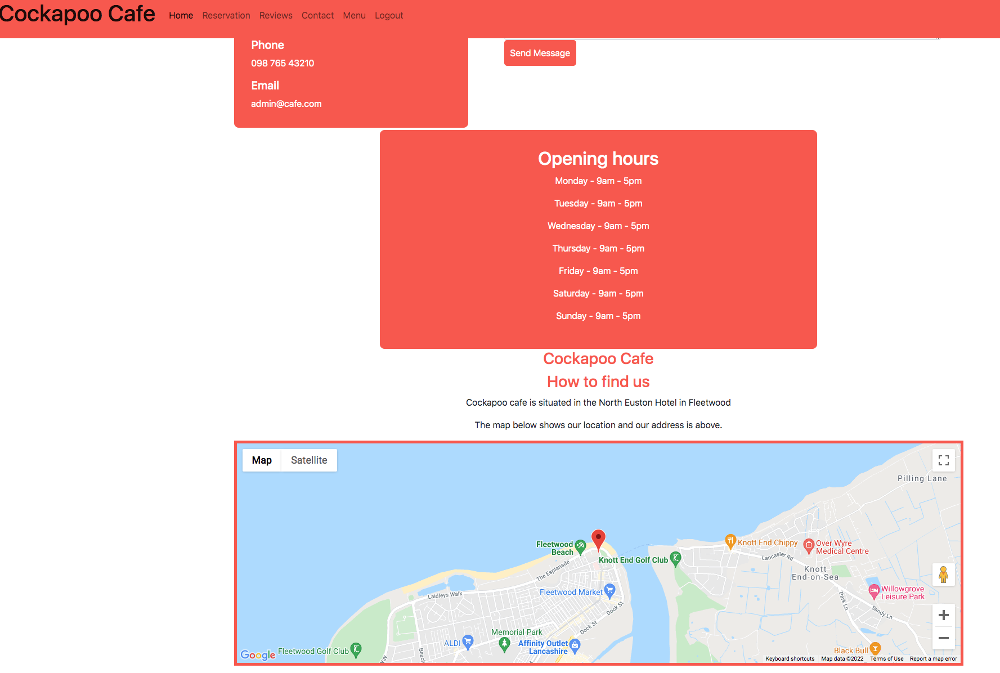

* The user is able to view the location of the cafe on a google map on the contact page. Above the map there is also the address of the cafe which could be used to put into a car sat nav for directions.
* This has been tested manually to ensure it works as it should.

12. As a site admin I can be notified of a message being received so that I can respond promptly.

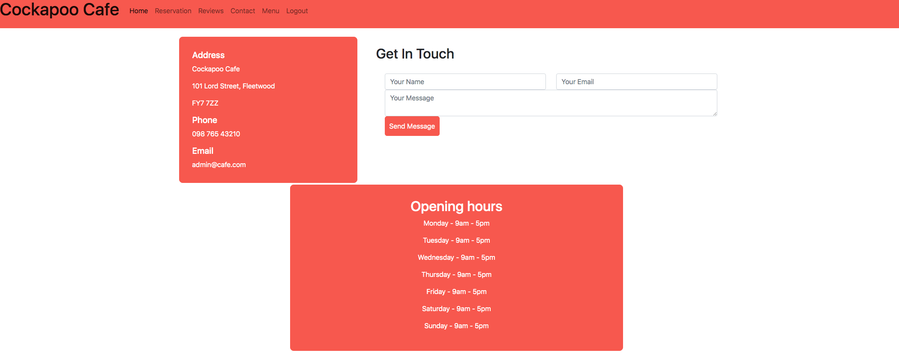

* The user is able to contact the cafe by phone or by email by completing the form on the contact page. Once the user clicks send mesasage, an email will be sent to the cafe with the name entered, email address the user entered to reply to and the content of the message.
* This has been tested manually to ensure it works as it should.

13. As a user I can intuitively understand the site and meaning so that I know if I want to stay on the site.

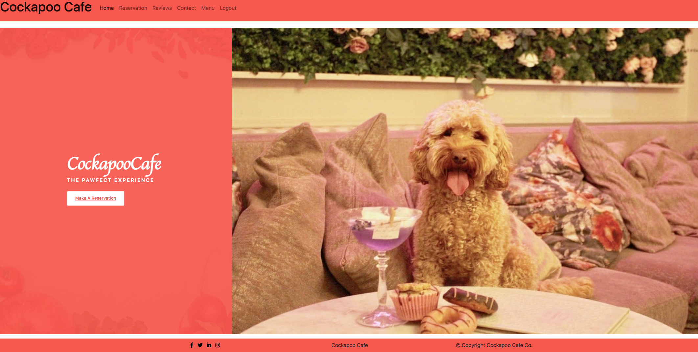

* When a user first lands on the site the purpose is clear, with a large title with the name of the cafe, images on the page and a link to make a reservation at the cafe.
* This has been tested manually to ensure it works as it should.

14. As a user I can intuitively navigate the site so that I can register/ login and make a reservation.

* The user is able to navigate the site intuitively as the navigation bar is site wide, meaning it is the same on every page. On sub pages of the main navigation pages there are buttons to go back to the main page.
* This has been tested manually to ensure it works as it should.

15. As a user I can Follow the sites social networks so that I can see events and offers.

* The user is able to view the cafe's social networks by clicking on the icons at the bottom of the page in the footer, this will help keep them uptodate with any offers or news the cafe has. These links will open in a new tab.
* This has been tested manually to ensure it works as it should.

## Manually Testing Functionality
### **Navigation**

|Element               |Action|Expected Result               |Pass/Fail|
|:-------------         |:----|:----------------------------------|:---|
| **NavBar**            |                                         |    |
|Site Name (logo area)  |Click|Redirect to home                   |Pass|
|                       |     |                                   |    |
|Home                   |Click|Redirect to home                   |Pass|
|                       |     |                                   |    |
|Reservation Link       |Click|Redirect to register page          |Pass|
|                       |     |(If user not in session)           |Pass|
|                       |Click|Redirect to reservation page       |Pass|
|                       |     |(If user in session)               |Pass|
|ADMIN RESERVATION LINK |     |                                   |Pass|
|(Reservations dropdown)|Click|Redirect to reservation page       |Pass|
|(Approve Res dropdown) |Click|Redirect to approve reservations   |Pass|
|                       |     |                                   |    |
|Log In Link (dropdown) |Click|Redirect to log in page            |Pass|
|                       |     |(Not visible if user in session)   |Pass|
|Register Link(dropdown)|Click|Redirect to add_product page       |Pass|
|                       |     |(Not visible if user in session)   |Pass|
|Review Link            |Click|Redirect to review page            |Pass|
|ADMIN REVIEW LINK      |     |                                   |    |
|(Review dropdown)      |Click|Redirect to review page            |Pass|
|(Approve Rev dropdown) |Click|Redirect to approve review         |Pass|
|                       |     |                                   |    |
|Contact Link           |Click|Redirect to contact page           |Pass|
|                       |     |                                   |Pass|
|Menu Link              |Click|Redirect to menu page              |Pass|
|ADMIN MENU LINK        |     |                                   |    |
|(Menu dropdown)        |Click|Redirect to menu page              |Pass|
|(Manage Menu dropdown) |Click|Redirect to Manage menu Items page |Pass|
|(Create Menu Cat dd)   |Click|Redirect to Create menu Category pg|Pass|
|(Create Menu Item dd)  |Click|Redirect to Create menu Item pg    |Pass|
|                       |     |                                   |    |
| **SideNav**           |     |                                   |    |
|Hamburger Icon         |Click|Open Sidenav                       |Pass|
|Site Name (logo area)  |Click|Redirect to home                   |Pass|
|                       |     |                                   |    |
|Home                   |Click|Redirect to home                   |Pass|
|                       |     |                                   |    |
|Reservation Link       |Click|Redirect to register page          |Pass|
|                       |     |(If user not in session)           |Pass|
|                       |Click|Redirect to reservation page       |Pass|
|                       |     |(If user in session)               |Pass|
|ADMIN RESERVATION LINK |     |                                   |Pass|
|(Reservations dropdown)|Click|Redirect to reservation page       |Pass|
|(Approve Res dropdown) |Click|Redirect to approve reservations   |Pass|
|                       |     |                                   |    |
|Log In Link (dropdown) |Click|Redirect to log in page            |Pass|
|                       |     |(Not visible if user in session)   |Pass|
|Register Link(dropdown)|Click|Redirect to add_product page       |Pass|
|                       |     |(Not visible if user in session)   |Pass|
|Review Link            |Click|Redirect to review page            |Pass|
|ADMIN REVIEW LINK      |     |                                   |    |
|(Review dropdown)      |Click|Redirect to review page            |Pass|
|(Approve Rev dropdown) |Click|Redirect to approve review         |Pass|
|                       |     |                                   |    |
|Contact Link           |Click|Redirect to contact page           |Pass|
|                       |     |                                   |Pass|
|Menu Link              |Click|Redirect to menu page              |Pass|
|ADMIN MENU LINK        |     |                                   |    |
|(Menu dropdown)        |Click|Redirect to menu page              |Pass|
|(Manage Menu dropdown) |Click|Redirect to Manage menu Items page |Pass|
|(Create Menu Cat dd)   |Click|Redirect to Create menu Category pg|Pass|
|(Create Menu Item dd)  |Click|Redirect to Create menu Item pg    |Pass|
|                       |     |                                   |    |
| **Footer**            |     |                                   |    |
|*Socials*              |     |                                   |    |
|Facebook Link          |Click|Open on external page              |Pass|
|Instagram Link         |Click|Open on external page              |Pass|
|Twitter Link           |Click|Open on external page              |Pass|

---
### **Home Page**
| Element               |Action| Expected Result            | Pass/Fail|
|:-------------         |:-----|:-----                            |:---|
|Reservation Link       |Click |Redirect to register page         |Pass|
|                       |      |(If user not in session)          |Pass|
|                       |Click |Redirect to reservation page      |Pass|
|                       |      |(If user in session)              |Pass|

---
### **Reservation Page**
| Element               |Action| Expected Result            | Pass/Fail|
|:-------------         |:-----|:-----                            |:---|
|Make Reservation Link  |Click |Redirect to create reservation pg |Pass|
|                       |      |(If user in session)              |Pass|
|                       |Click |Redirect to reservation page      |Pass|
|                       |      |(If user in session)              |Pass|
|                       |      |                                  |    |
|Update Reservation Link|Click |Redirect to Update reservation pg |Pass|
|                       |      |(If user in session)              |    |
|                       |      |                                  |    |
|Delete Reservation Link|Click |Redirect to Delete reservation pg |Pass|
|                       |      |(If user in session)              |    |
|ADMIN APPROVE RESERVATION     |                                  |    |
|Approve Reservation    |Click |Redirect to Approve reservation pg|Pass|
|                       |      |(If admin user in session)        |Pass|
|                       |      |                                  |    |
|Create Reservation     |Form  |Message appears to inform the user|Pass|
|Messages appear        |Post  |a reservation has been created    |Pass|
|                       |      |                                  |    |
|Update Reservation     |Form  |Message appears to inform the user|Pass|
|Messages appear        |Post  |a reservation has been Updated    |Pass|
|                       |      |                                  |    |
|Deleted Reservation    |Form  |Message appears to inform the user|Pass|
|Messages appear        |Post  |a reservation has been Deleted    |Pass|

---
### **Create Reservation Page**
| Element               |Action| Expected Result            | Pass/Fail|
|:-------------         |:-----|:-----                            |:---|
|**Form**               |      |                                  |    |
|First name field       |Filled|Field must be filled in or warning|Pass|
|                       |      |                                  |    |
|Last name field        |Filled|Field must be filled in or warning|Pass|
|                       |      |                                  |    |
|Email field            |Filled|Field must be filled and comply   |Pass|
|                       |      |or warning will appear            |    |
|Phone field            |Filled|Field not needed but must comply  |Pass|
|                       |      |if it is or warning will appear   |    |
|Time field             |Filled|Field must be filled default set  |Pass|
|                       |      |                                  |    |
|Date field             |Filled|Field must be selected from       |Pass|
|                       |      |dropdown selection and in future  |Pass|
|Information field      |Filled|Field can be left blank           |Pass|
|                       |      |but placeholder set               |    |
|Submit Link            |Click |Redirect to reservation pg and    |Pass|
|                       |      |make reservation                  |Pass|
|Cancel Link            |Click |Redirect to reservation pg and    |Pass|
|                       |      |cancel reservation                |Pass|

---
### **Update Reservation Page**
| Element               |Action| Expected Result            | Pass/Fail|
|:-------------         |:-----|:-----                            |:---|
|**Form**               |      |                                  |    |
|First name field       |Filled|Field must be filled in or warning|Pass|
|                       |      |                                  |    |
|Last name field        |Filled|Field must be filled in or warning|Pass|
|                       |      |                                  |    |
|Email field            |Filled|Field must be filled and comply   |Pass|
|                       |      |or warning will appear            |    |
|Phone field            |Filled|Field not needed but must comply  |Pass|
|                       |      |if it is or warning will appear   |    |
|Time field             |Filled|Field must be filled default set  |Pass|
|                       |      |                                  |    |
|Date field             |Filled|Field must be selected from       |Pass|
|                       |      |dropdown selection and in future  |Pass|
|Information field      |Filled|Field can be left blank           |Pass|
|                       |      |but placeholder set               |    |
|Submit Link            |Click |Redirect to reservation pg and    |Pass|
|                       |      |make reservation                  |Pass|
|Cancel Link            |Click |Redirect to reservation pg and    |Pass|
|                       |      |cancel reservation                |Pass|

---
### **Delete Reservation Page**
| Element               |Action| Expected Result            | Pass/Fail|
|:-------------         |:-----|:-----                            |:---|
|**Form**               |      |                                  |    |
|Confirm Link           |Click |Redirect to reservation pg and    |Pass|
|                       |      |delete reservation                |Pass|
|Cancel Link            |Click |Redirect to reservation pg and    |Pass|
|                       |      |cancel reservation deletion       |Pass|

---
### **Admin Approve Reservation Page**
| Element               |Action| Expected Result            | Pass/Fail|
|:-------------         |:-----|:-----                            |:---|
|**Form**               |      |                                  |    |
|Approve Reservation Link|Click|Approve reservation and show msg  |Pass|
|                       |      |it has been approved, reservation |Pass|
|                       |      |will not appear on page           |Pass|
|                       |      |It will be approved on reservation|Pass|
|                       |      |page highlighted in green         |Pass|
|Reject Reservation Link|Click |Reject reservation and show msg   |Pass|
|                       |      |it has been rejected, reservation |Pass|
|                       |      |will not appear on page           |Pass|
|                       |      |It will be approved on reservation|Pass|
|                       |      |page highlighted in red           |Pass|
|Back to Reservation Link|Click|Redirects back to reservation pg  |Pass|

---
### **Review Page**
| Element               |Action| Expected Result            | Pass/Fail|
|:-------------         |:-----|:-----                            |:---|
|Leave Review Link      |Click |Redirect to create review pg      |Pass|
|                       |      |(If user in session)              |Pass|
|                       |      |                                  |    |
|Update Review Link     |Click |Redirect to Update review pg      |Pass|
|                       |      |(If user in session)              |    |
|                       |      |                                  |    |
|Delete Review Link     |Click |Redirect to Delete review pg      |Pass|
|                       |      |(If user in session)              |    |
|ADMIN APPROVE REVIEW   |      |                                  |    |
|Approve Review         |Click |Redirect to Approve review pg     |Pass|
|                       |      |(If admin user in session)        |Pass|
|                       |      |                                  |    |
|Create Review          |Form  |Message appears to inform the user|Pass|
|Messages appear        |Post  |a review has been created         |Pass|
|                       |      |                                  |    |
|Update Review          |Form  |Message appears to inform the user|Pass|
|Messages appear        |Post  |a review has been Updated         |Pass|
|                       |      |                                  |    |
|Deleted Review         |Form  |Message appears to inform the user|Pass|
|Messages appear        |Post  |a review has been Deleted         |Pass|
|                       |      |                                  |    |
|Like Button            |Click |if clicked a like is counted      |Pass|
|                       |      |and button changes to unlike      |Pass|
|                       |      |                                  |    |
|Unlike Button          |Click |if clicked a like is uncounted    |Pass|
|                       |      |and button changes to like        |Pass|

---
### **Create Review Page**
| Element               |Action| Expected Result            | Pass/Fail|
|:-------------         |:-----|:-----                            |:---|
|**Form**               |      |                                  |    |
|Title field            |Filled|Field has default no_title set    |Pass|
|                       |      |                                  |    |
|Body field             |Filled|Field must be filled in or warning|Pass|
|                       |      |                                  |    |
|Image field            |Select|User can choose an image or not   |Pass|
|                       |      |a default image will be set       |Pass|
|Submit Link            |Click |Redirect to review pg and         |Pass|
|                       |      |make review                       |Pass|
|Cancel Link            |Click |Redirect to review pg and         |Pass|
|                       |      |cancel review                     |Pass|

---
### **Update Review Page**
| Element               |Action| Expected Result            | Pass/Fail|
|:-------------         |:-----|:-----                            |:---|
|**Form**               |      |                                  |    |
|Title field            |Filled|Field has default no_title set    |Pass|
|                       |      |                                  |    |
|Body field             |Filled|Field must be filled in or warning|Pass|
|                       |      |                                  |    |
|Image field            |Select|User can choose an image or not   |Pass|
|                       |      |a default image will be set       |Pass|
|Submit Link            |Click |Redirect to review pg and         |Pass|
|                       |      |make review                       |Pass|
|Cancel Link            |Click |Redirect to review pg and         |Pass|
|                       |      |cancel review                     |Pass|

---
### **Delete Review Page**
| Element               |Action| Expected Result            | Pass/Fail|
|:-------------         |:-----|:-----                            |:---|
|**Form**               |      |                                  |    |
|Confirm Link           |Click |Redirect to review pg and         |Pass|
|                       |      |delete review                     |Pass|
|Cancel Link            |Click |Redirect to review pg and         |Pass|
|                       |      |cancel review deletion            |Pass|

---
### **Admin Approve Review Page**
| Element               |Action| Expected Result            | Pass/Fail|
|:-------------         |:-----|:-----                            |:---|
|**Form**               |      |                                  |    |
|Approve Review Link    |Click |Approve review and show msg       |Pass|
|                       |      |it has been approved, review      |Pass|
|                       |      |will not appear on page           |Pass|
|                       |      |It will be approved on review     |Pass|
|                       |      |page                              |Pass|
|Reject Reservation Link|Click |Reject review and show msg        |Pass|
|                       |      |it has been rejected, review      |Pass|
|                       |      |will not appear on page           |Pass|
|                       |      |It will be not be approved on     |Pass|
|                       |      |review page and will be deleted   |Pass|
|Back to Reviews Link   |Click |Redirects back to the review page |Pass|

---
### **Contact Page**
| Element               |Action| Expected Result            | Pass/Fail|
|:-------------         |:-----|:-----                            |:---|
|Sent Email Form        |Filled|Fields must be filled in          |Pass|
|                       |      |                                  |    |
|Send Message Button    |Click |Submits contact form and email    |Pass|
|                       |      |is sent to site owner             |Pass|
|                       |      |Message appears to inform user    |Pass|
|                       |      |the form was sent                 |Pass|
|Google Map             |      |Map displays on page              |Pass|

---
### **Menu Page**
| Element               |Action| Expected Result            | Pass/Fail|
|:-------------         |:-----|:-----                            |:---|
|Hot Drinks menu Link   |Click |Redirect to Hot dirnks menu pg    |Pass|
|                       |      |                                  |    |
|Cold Drinks menu Link  |Click |Redirect to Cold dirnks menu pg   |Pass|
|                       |      |                                  |    |
|Cakes menu Link        |Click |Redirect to Cakes menu pg         |Pass|
|                       |      |                                  |    |
|Sandwich menu Link     |Click |Redirect to Sandwich menu pg      |Pass|
|                       |      |                                  |    |
|Further menu Link      |Click |Redirect to that menu pg          |Pass|
|(if created by admin)  |      |                                  |Pass|

---
### **Menu Category Page**
| Element               |Action| Expected Result            | Pass/Fail|
|:-------------         |:-----|:-----                            |:---|
|Back to Main menu Link |Click |Redirect to main menu pg          |Pass|
|                       |      |                                  |    |
|Like Button            |Click |if clicked a like is counted      |Pass|
|                       |      |and button changes to unlike      |Pass|
|                       |      |(if user logged in)               |    |
|Unlike Button          |Click |if clicked a like is uncounted    |Pass|
|                       |      |and button changes to like        |Pass|
|                       |      |(if user logged in)               |    |

---
### **Admin Menu Page**
| Element               |Action| Expected Result            | Pass/Fail|
|:-------------         |:-----|:-----                            |:---|
|Hot Drinks menu Link   |Click |Redirect to Hot dirnks menu pg    |Pass|
|                       |      |                                  |    |
|Cold Drinks menu Link  |Click |Redirect to Cold dirnks menu pg   |Pass|
|                       |      |                                  |    |
|Cakes menu Link        |Click |Redirect to Cakes menu pg         |Pass|
|                       |      |                                  |    |
|Sandwich menu Link     |Click |Redirect to Sandwich menu pg      |Pass|
|                       |      |                                  |    |
|Further menu Link      |Click |Redirect to that menu pg          |Pass|
|                       |      |                                  |    |
|Create Category Link   |Click |Redirect to Create category pg    |Pass|
|                       |      |(Admin only)                      |    |
|Update Category Link   |Click |Redirect to update category pg    |Pass|
|                       |      |(Admin only)                      |    |
|Delete Category Link   |Click |Redirect to delete category pg    |Pass|
|                       |      |(Admin only)                      |    |
|Create Menu Items Link |Click |Redirect to Menu items pg         |Pass|
|                       |      |(Admin only)                      |    |

---
### **Admin Create Menu Category Page**
| Element               |Action| Expected Result            | Pass/Fail|
|:-------------         |:-----|:-----                            |:---|
|**Form**               |      |                                  |    |
|Name field             |Filled|Field must be filled in or warning|Pass|
|                       |      |                                  |    |
|Description field      |Filled|Field must be filled in or warning|Pass|
|                       |      |                                  |    |
|Submit Link            |Click |Redirect to menu pg and           |Pass|
|                       |      |make Category                     |Pass|
|Cancel Link            |Click |Redirect to menu pg and           |Pass|
|                       |      |cancel category creation          |Pass|

---
### **Admin Update Menu Category Page**
| Element               |Action| Expected Result            | Pass/Fail|
|:-------------         |:-----|:-----                            |:---|
|**Form**               |      |                                  |    |
|Name field             |Filled|Field must be filled in or warning|Pass|
|                       |      |                                  |    |
|Description field      |Filled|Field must be filled in or warning|Pass|
|                       |      |                                  |    |
|Submit Link            |Click |Redirect to menu pg and           |Pass|
|                       |      |make Category                     |Pass|
|Cancel Link            |Click |Redirect to menu pg and           |Pass|
|                       |      |cancel category creation          |Pass|

---
### **Admin Delete Menu Category Page**
| Element               |Action| Expected Result            | Pass/Fail|
|:-------------         |:-----|:-----                            |:---|
|                       |      |                                  |    |
|Confirm Link           |Click |Redirect to menu pg and           |Pass|
|                       |      |delete category (no items left)   |Pass|
|Cancel Link            |Click |Redirect to menu pg and           |Pass|
|                       |      |cancel category deletion          |Pass|

---
### **Admin Menu Item Page**
| Element               |Action| Expected Result            | Pass/Fail|
|:-------------         |:-----|:-----                            |:---|
|                       |      |                                  |    |
|Create Menu Item Link  |Click |Redirect to Create Menu Item pg   |Pass|
|                       |      |(Admin only)                      |    |
|Update Item Link       |Click |Redirect to update Item pg        |Pass|
|                       |      |(Admin only)                      |    |
|Delete Item Link       |Click |Redirect to delete Item pg        |Pass|
|                       |      |(Admin only)                      |    |
|Create Menu Items Link |Click |Redirect to Menu items pg         |Pass|
|                       |      |(Admin only)                      |    |
|Back Link              |Click |Redirect to main Menu pg          |Pass|

---
### **Admin Create Menu Item Page**
| Element               |Action| Expected Result            | Pass/Fail|
|:-------------         |:-----|:-----                            |:---|
|**Form**               |      |                                  |    |
|Name field             |Filled|Field must be filled in or warning|Pass|
|                       |      |                                  |    |
|Description field      |Filled|Field must be filled in or warning|Pass|
|                       |      |                                  |    |
|Image field            |Select|User can choose an image or not   |Pass|
|                       |      |a default image will be set       |Pass|
|Category field         |Select|User can choose the category of   |Pass|
|                       |      |the menu item or will be warned   |Pass|
|Price field            |Filled|Field must be filled default set  |Pass|
|                       |      |                                  |    |
|Submit Link            |Click |Redirect to menu Item pg and      |Pass|
|                       |      |make Menu item                    |Pass|
|Cancel Link            |Click |Redirect to menu Item pg and      |Pass|
|                       |      |cancel Menu Item creation         |Pass|

---
### **Admin Update Menu Item Page**
| Element               |Action| Expected Result            | Pass/Fail|
|:-------------         |:-----|:-----                            |:---|
|**Form**               |      |                                  |    |
|Name field             |Filled|Field must be filled in or warning|Pass|
|                       |      |                                  |    |
|Description field      |Filled|Field must be filled in or warning|Pass|
|                       |      |                                  |    |
|Image field            |Select|User can choose an image or not   |Pass|
|                       |      |a default image will be set       |Pass|
|Category field         |Select|User can choose the category of   |Pass|
|                       |      |the menu item or will be warned   |Pass|
|Price field            |Filled|Field must be filled default set  |Pass|
|                       |      |                                  |    |
|Submit Link            |Click |Redirect to menu Item pg and      |Pass|
|                       |      |make Menu item                    |Pass|
|Cancel Link            |Click |Redirect to menu Item pg and      |Pass|
|                       |      |cancel Menu Item creation         |Pass|

---
### **Admin Delete Menu Item Page**
| Element               |Action| Expected Result            | Pass/Fail|
|:-------------         |:-----|:-----                            |:---|
|                       |      |                                  |    |
|Confirm Link           |Click |Redirect to menu item pg and      |Pass|
|                       |      |delete Menu Item                  |Pass|
|Cancel Link            |Click |Redirect to menu item pg and      |Pass|
|                       |      |cancel Menu Item deletion         |Pass|

---
### **Sign Out Page**
| Element               |Action| Expected Result            | Pass/Fail|
|:-------------         |:-----|:-----                            |:---|
|                       |      |                                  |    |
|Sign Out Link          |Click |Redirect to home page             |Pass|
|                       |      |                                  |Pass|
|Cancel Link            |Click |Redirect to home page             |Pass|
|                       |      |                                  |    |

---
### **Sign In Page**
| Element               |Action| Expected Result            | Pass/Fail|
|:-------------         |:-----|:-----                            |:---|
|Username field         |Select|User must fill in username or     |Pass|
|                       |      |get a warning message             |Pass|
|Password field         |Filled|User must fill in password or     |Pass|
|                       |      |get a warning message             |Pass|
|                       |      |                                  |    |
|Sign In Link           |Click |Redirect to home page             |Pass|
|                       |      |                                  |    |
|Cancel Link            |Click |Redirect to home page             |Pass|
|                       |      |                                  |    |

---
### **Register Page**
| Element               |Action| Expected Result            | Pass/Fail|
|:-------------         |:-----|:-----                            |:---|
|Username field         |Select|User must fill in username or     |Pass|
|                       |      |get a warning message             |Pass|
|Email field            |Filled|User can choose to enter email    |Pass|
|                       |      |                                  |Pass|
|Password field         |Filled|User must fill in password or     |Pass|
|                       |      |get a warning message             |Pass|
|                       |      |                                  |    |
|Password (again) field |Filled|User must fill in password and    |Pass|
|                       |      |match or get a warning message    |Pass|
|Register Link          |Click |Redirect to home page             |Pass|
|                       |      |                                  |    |
|Cancel Link            |Click |Redirect to home page             |Pass|
|                       |      |                                  |    |

### Testing on Devices

* I have tested the deployed Heroku app on different devices such as Macbook Pro, Samsung Galaxy Tab and iphone. Any issues found have been fixed and reported in the bugs section. I no longer see issues with the site working on them.

### Testing on different browsers
* I have tested the site on google chrome and all works well.
* I have tested the site on Safari and all works well.

### Exploratory Testing
* A session was held with a sample of testers who were asked to test the site. Testers were asked to test on mobile devices as well as their home computers and report any issues or recomendations.

* Tester 1 - Thought the site was easy to use and navigate around. They felt it was easy to sign up and make a reservation and leave a review. Editing the reservation was also easy to do and worked. They felt that after leaving a review they couldn't view the review until it had been approved could possibly be improved. The menu was easy to understand and navigate between.

* Tester 2 - Thought the site was easy to understand and navigate. It was easy to sign up and they liked that they were informed that they had successfully signed up. Making, editing and deleting reservations was straightforward but found that the edit and delete buttons overlapped on the mobile device (This is highlighted in the bugs section and has been resolved).Leaving a review was easy but they couldn't edit or delete until after it had been approved. The menu was easily understood and moved between. They suggested maybe an extra feature to select and order the items. The contact page was nicely set out and filling out the contact form was straightforward. They liked the map feature at the bottom of the page. They liked that they were informed of all the actions.   

* Tester 3 - Gave the site a thorough test. They commented that they liked the look of the site and that the CRUD functionallity worked as they expected. They also tested to see if they could access other users update reviews through typing in different numbers in the url. This was found to work and therefore I have updated the views on reservation and reviews with a statement that checks that the user is the creater of the review/reservation and if not it will redirect them and flag a warning to them saying that the action is unauthorised.

## Bugs

### Fixed
* When I created the reservation form, it was not a good experience as a user to enter a date. To solve this I used a datepicker and implemented through the create_review view and Update_review view.
* I implemented emailjs to send the contact message on the contact page, which worked but the messages to confirm the messsage had been sent didn't display so I removed emailjs and used python to send the email.
* When I tried to upload an image on the review form the image would't load and the placeholder inage was set. In order to solve this I had to use enctype="multiport/formdata" in the form which I found when searching stackoverflow. Images are now loaded and saved on both create and update forms.
* When a form was submitted the success messages were not displaying. I had to import success messages in the view and add them in the view perameters.
* I had trouble getting the like button to change to unlike when the user hads liked the item. To fix I had to use the all() in the tamplate tag.
* An error was highlighted on the Review.html page when put through the HTML validator. This was corrected by adding an alt to the image and moving the width="100%" to the css file.
* The pep8 validator picked up a line with whitespace on it in the reservation update view and review update view. This was resolved by removing the whitespace.
* When a user made a reservation sometimes they were unabel to see it. This was because the page was paginated by the date and so it appeared on a different page. To solve this I removed the pagination.
* During testing on mobile devices some buttons overlapped on the reservation page such as the update and delete buttons. This was solved by adding the inline-flex class to the buttons.
* During exploratior testing a user found that they could forcfully update another users review but changing the number in the url. To fix this I have added a statement in the update views of the review and reservation views to compare the creators id with the current user and if not they will be redirected and shown a warning to tell them they are not authorised.
* An error was being displayed in the console reffering to a TypeError to do with boostrap. This was occuring as javascript was trying to clear messages that were not there. To solve this I added and if statement to the script which has solved the issue.

### Known issues
* The contact tab in the nav doesn't show up as active when on the page, instead the home page does, this could be down to the contact page being in the home app.